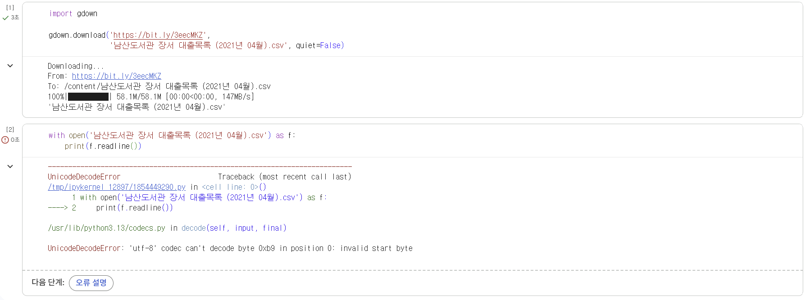
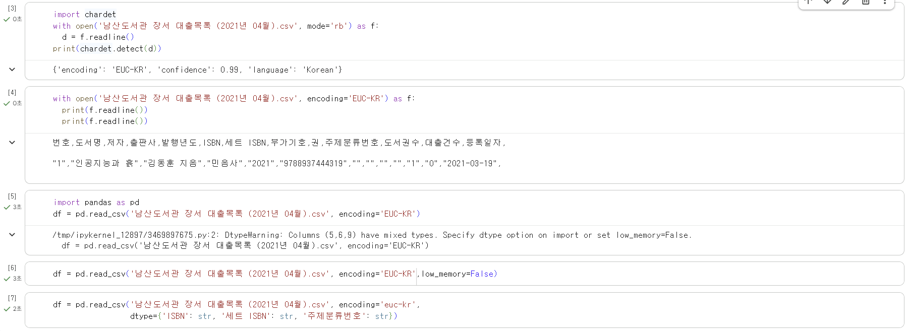
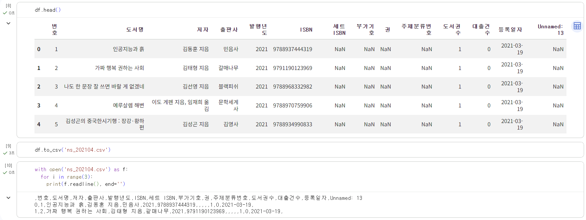
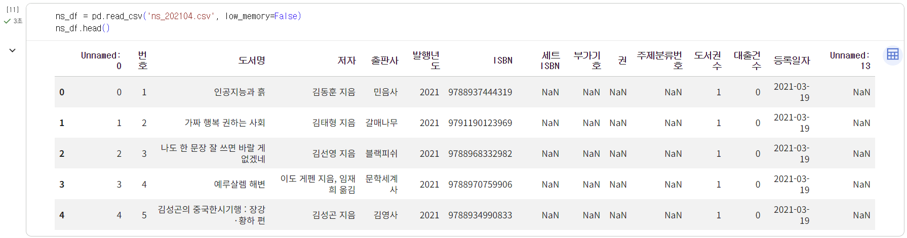
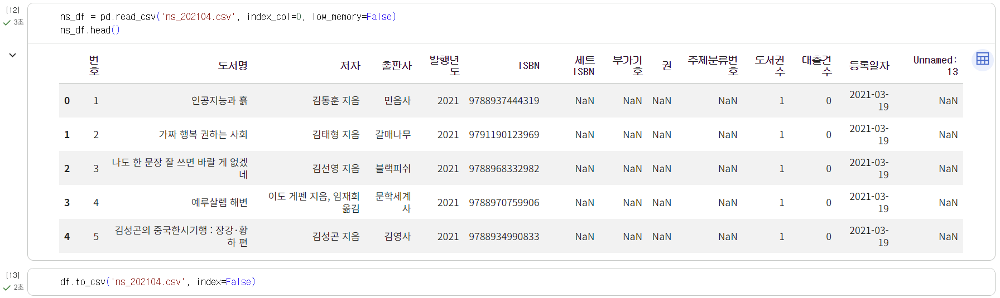
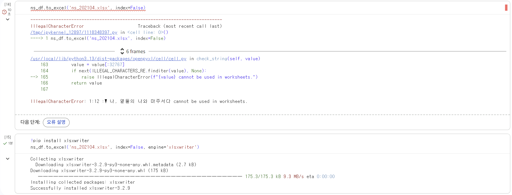

# 데이터분석 1주차 정규과제

📌데이터분석 정규과제는 매주 정해진 분량의 『*혼자 공부하는 데이터 분석 with 파이썬*』 을 읽고 학습하는 것입니다. 이번 주는 아래의 **DataAnalysis_1st_TIL**에 나열된 분량을 읽고 공부하시면 됩니다.

아래의 문제를 풀어보며 학습 내용을 점검하세요. 문제를 해결하는 과정에서 개념을 스스로 정리하고, 필요한 경우 제시된 강의를 참고하여 보완하는 것이 좋습니다.

<!-- 강의 링크는 아래와 같습니다.
https://www.youtube.com/watch?v=qGE_rT_oQaQ&list=PLVsNizTWUw7FGzSRCkQrPEEe-ljVXgS7k
https://www.youtube.com/watch?v=tp9XmeaHU0E&list=PLVsNizTWUw7FGzSRCkQrPEEe-ljVXgS7k&index=2
https://www.youtube.com/watch?v=D46j-e_IHlI&list=PLVsNizTWUw7FGzSRCkQrPEEe-ljVXgS7k&index=3
-->


## DataAnalysis_1st_TIL

### 1장 데이터 분석을 시작하며
#### 01. 데이터 분석이란
#### 02. 구글 코랩과 주피터 노트북
#### 03. 이 도서가 얼마나 인기가 좋을까요?


## Study Schedule

| 주차  | 공부 범위     | 완료 여부 |
| ----- | ------------- | --------- |
| 1주차 | p.24~81    | ✅         |
| 2주차 | p.84~151   | 🍽️         |
| 3주차 | p.154~219  | 🍽️         |
| 4주차 | p.222~279 | 🍽️         |
| 5주차 | p.282~325 | 🍽️         |
| 6주차 | p.328~379 | 🍽️         |
| 7주차 | p.382~430 | 🍽️         |

<br>

<!-- 여기까진 그대로 둬 주세요-->


# 1️⃣ 개념 정리 

## 01. 데이터 분석이란

유용한 정보를 발견하고 결론을 유추하거나, 의사결정을 돕기 위해 데이터를 조사, 정제, 변환, 모델링하는 과정이다. 
솔루션보다 사람의 의사결정을 위한 통찰을 제공하는 데 초점이 맞춰져 있다. 
통계적 관점에서 기술통계, 탐색적 데이터 분석, 가설검정으로 나눌 수 있다. 

-> 데이터를 수집, 처리, 정제, 분석, 모델링하여 의사 결정을 내리는 데 도움을 주는 작업이다. 통계학과 머신러닝의 기술을 사용하고 비즈니스 문제를 해결하기 위해 모데인 지식이 필요하다. 

## 02. 구글 코랩과 주피터 노트북

구글 코랩은 구글이 대화식 프로그래밍 환경인 주피터 노트북의 장점을 바탕으로 커스터마이징하여 개발한 클라우드 기반 서비스로 웹 브라우저에서 무료로 파이썬 코드를 작성하고 실행할 수 있다. 
기본적인 데이터 분석과 관련된 여러 도구들도 함께 제공하기 때문에 편리하게 사용할 수 있다.

## 03. 이 도서가 얼마나 인기가 좋을까요?

혼공출판사에서 새로운 책을 출판하려고 하는데 이 책이 잘 팔릴지 안 팔리지 데이터 분석을 통해서 파악해보려고 한다. 
도서관 정보나루에서 남산 도서관에 있는 장서, 대출 데이터를 이용한다. 
CSV 파일은 콤마로 구분된 텍스트 파일이다. 한 줄이 하나의 레코드이며 레코드는 콤마로 구분된 여러 필드로 구성되고, 레코드에 있는 필드 개수는 동일하다. 
한글 인코딩 형식은 'EUC-KR'이다. 
low_memory='False'로 하면 csv파일을 나누어 읽지 않고 한 번에 읽기 때문에 많은 메모리를 사용하여 열의 데이터 타입을 자동으로 찾지 않도록 dtype으로 데이터 타입을 지정하여 경고를 발생하지 않게 할 수 있다. 
데이터프레일음 to_csv()를 사용하여 csv파일로 저장하면 나중에 open() 함수로 읽을 때 따로 인코딩 매개변수 사용하지 않아도 된다. 


# 2️⃣ 수행 인증









<br>
<br>

# 3️⃣ 확인 문제

## 문제 1.

> **🧚Q. 데이터 분석의 개념을 넓은 의미와 좁은 의미로 나누어 설명하고, 두 개념의 차이점도 함께 정리해주세요.**


```
좁은 의미의 데이터 분석은 기술통계, 탐색적 데이터 분석, 가설검정이고, 넓은 의미의 데이터 분석은 데이터를 수집, 처리, 정제, 모델링까지 포함하는 과정이다. 
좁은 의미의 데이터 분석은 데이터를 분석 및 해석하는 단계 자체에 초점을 맞춘다면, 넓은 의미의 데이터 분석은 분석을 위한 데이터 준비부터 결과 도출까지 전체 과정을 포함한다.
```


### 🎉 수고하셨습니다.