# 데이터분석 2주차 정규과제

📌데이터분석 정규과제는 매주 정해진 분량의 『*혼자 공부하는 데이터 분석 with 파이썬*』 을 읽고 학습하는 것입니다. 이번 주는 아래의 **DataAnalysis_2nd_TIL**에 나열된 분량을 읽고 공부하시면 됩니다.

아래의 문제를 풀어보며 학습 내용을 점검하세요. 문제를 해결하는 과정에서 개념을 스스로 정리하고, 필요한 경우 제시된 강의를 참고하여 보완하는 것이 좋습니다.

<!-- 강의 링크는 아래와 같습니다.
https://www.youtube.com/watch?v=s_-VvTLb3gs&list=PLVsNizTWUw7FGzSRCkQrPEEe-ljVXgS7k&index=4
https://www.youtube.com/watch?v=Il6L8OtNFpc&list=PLVsNizTWUw7FGzSRCkQrPEEe-ljVXgS7k&index=5
-->


## DataAnalysis_2nd_TIL

### 2장 데이터 수집하기
#### 01. API 사용하기
#### 02. 웹 스크래핑 사용하기


## Study Schedule

| 주차  | 공부 범위     | 완료 여부 |
| ----- | ------------- | --------- |
| 1주차 | p.24~81    | ✅         |
| 2주차 | p.84~151   | ✅         |
| 3주차 | p.154~219  | 🍽️         |
| 4주차 | p.222~279 | 🍽️         |
| 5주차 | p.282~325 | 🍽️         |
| 6주차 | p.328~379 | 🍽️         |
| 7주차 | p.382~430 | 🍽️         |

<br>

<!-- 여기까진 그대로 둬 주세요-->


# 1️⃣ 개념 정리 

## 01. API 사용하기

데이터베이스 안에 민감한 정보가 있거나 회사 정책상 데이터베이스의 결함이 생기지 않게 무결성을 위해 다른 사용자의 접근을 막는다. 이럴 때 API를 사용해서 데이터를 사용할 수 있다. 
API는 두 프로그램 사이에 대화하는 어떤 규칙을 정의한 것으로, 두 프로그램이 데이터를 주고 받기 위해 약속된 신호 체계라고 할 수 있다. 

HTTP는 웹 브라우저가 사용하는 통신 규약으로, 텍스트 기반의 프로토콜이다. 웹 브라우저가 웹 서버에게 데이터를 요청하고 웹 서버는 거기에 맞는 데이터를 웹 브라우저로 전송한다. 웹 브라우저가 화면을 보여줄 때는 HTML은 브라우저가 웹 서버로부터 회신 받는 데이터이다. HTML은 구조가 복잡하기 때문에 CSV, JSON, XML로 데이터를 받을 수 있다. 

데이터 요청을 받으면 파이썬 객체를 만들고 json.dumps()로 문자열 변환하여 다른 프로그램에 전송하면 json.loads()로 파이썬 객체 변환한다. read_json()은 판다스의 데이터프레임으로 바로 변환할 수 있다. 

XML은 HTML보다 구조적이고 정제된 버전이다. fromstring()으로 파이썬 객체 변환하면 Element 클래스의 객체로 변환된다. 


## 02.웹 스크래핑 사용하기

requests.get(브라우저 주소)로 HTML를 가져올 수 있다. 도서 검색 결과를 가져와서 도서의 상세 페이지로 연결되는 링크 URL을 추출하여 이걸 다시 request.get()으로 HTML을 가져와 원하는 정보를 추출할 수 있다. 

HTML의 내용을 구조적으로 탐색할 수 있는 가장 대표적인 파이썬 라이브러리인 뷰티풀수프를 사용하여 전체 HTML에 있는 내용애서 원하는 태그의 요소를 검색할 수 있다. 태그를 확인한 다음 find() 메소드를 사용해서 태그를 찾고 find_all() 메소드로 리스트로 가져온다. 

웹사이트가 바뀌면 그 HTML이 바뀌기 때문에 다시 프로그램을 수정해야하기 때문에 웹스크래핑 데이터를 가져오는 것은 가급적 안 하지는 것이 좋다. 웹사이트에서 스크래핑을 허락했는지 확인하고, 찾고자 하는 어떤 요소가 있는 위치를 특정할 수 있는지 확인해야 한다. 좋은 웹 스크래핑 프로그램을 짠다면 디자인이 바뀌었을 때 HTML 파싱하지 못하고 에러 나면 로그를 쌓고 알람이 오도록 하는 것이 좋다. 

원하는 열만 추출하려면 df[['컬럼', ...]], 더 간편하게는 df.loc[[0,1], ['컬럼', ...]]으로 원하는 행과 열만 추출할 수 있다. 

파이썬의 슬라이싱은 마지막 원소는 슬라이싱에 포함되지 않지만 데이터 프레임의 슬라이싱은 마지막 인덱스도 포함된다. 


# 2️⃣ 수행 인증

## 2-1
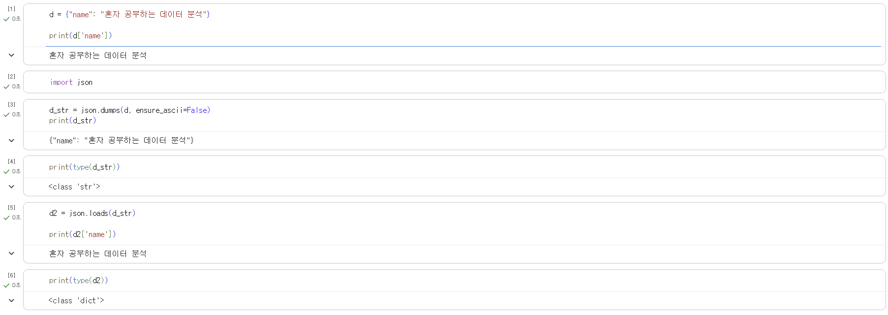
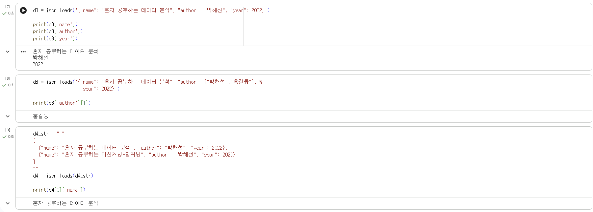
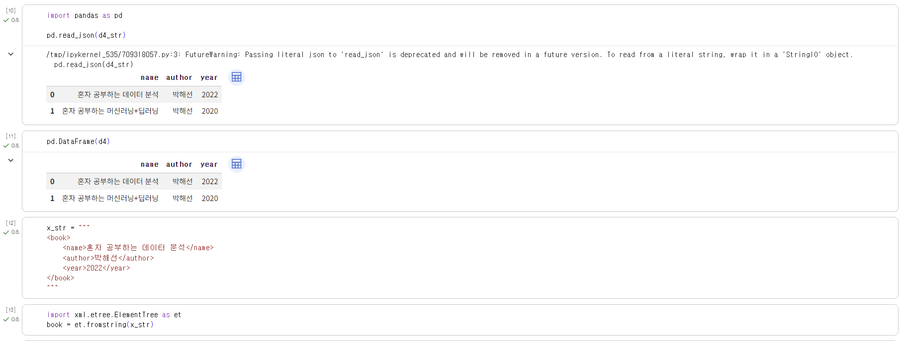
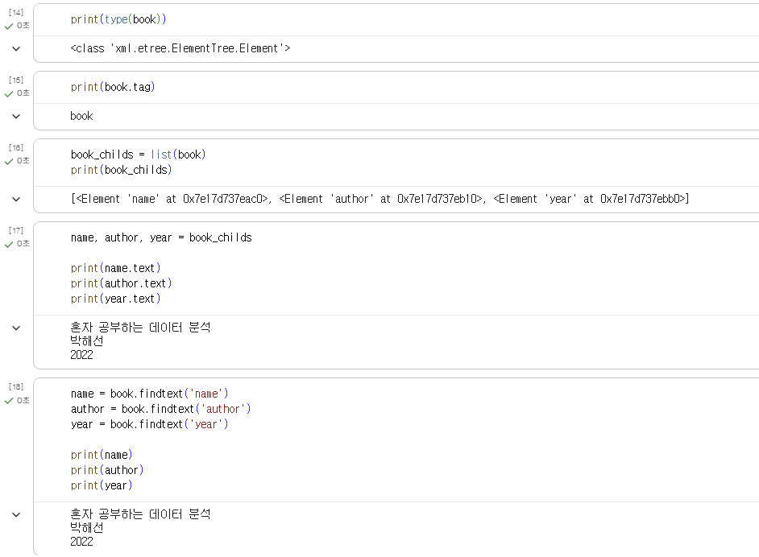
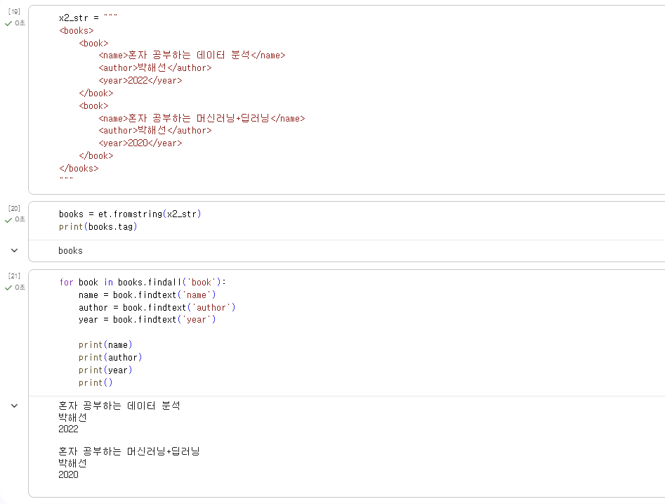
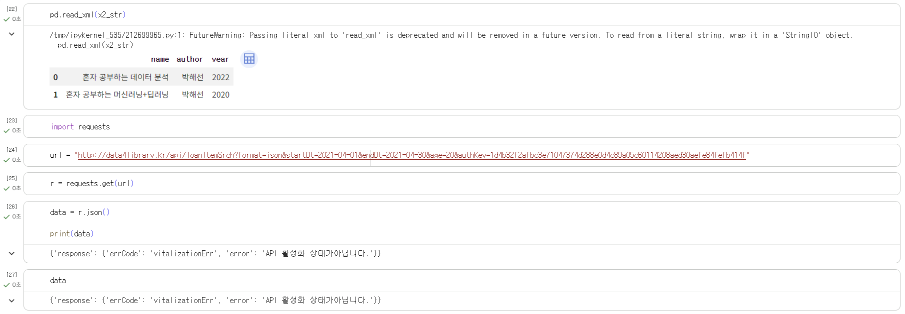
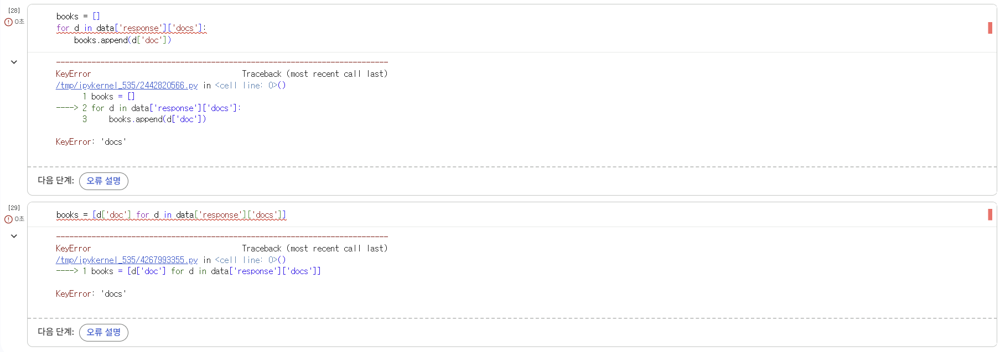
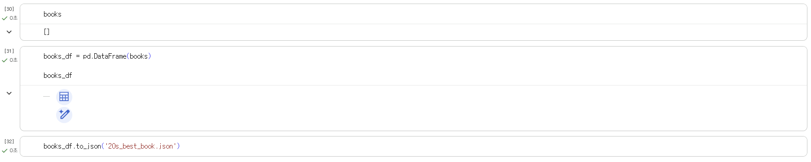

<br>

## 2-2
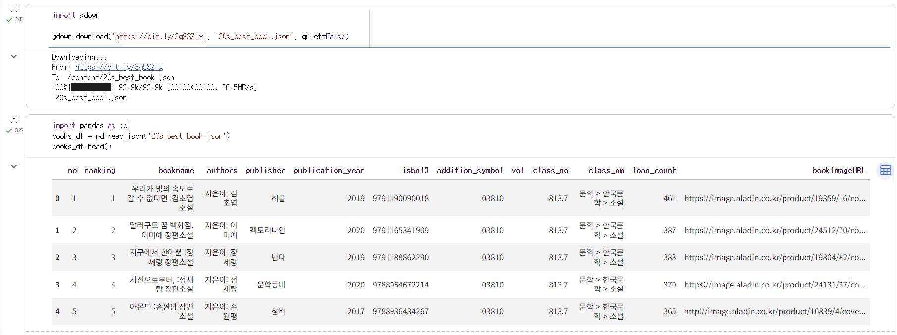
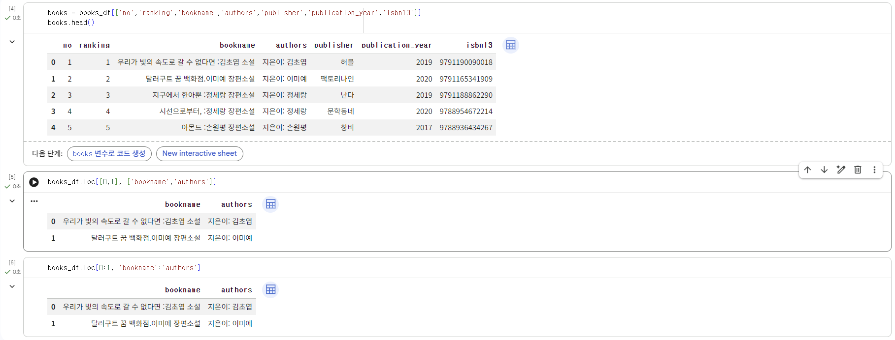
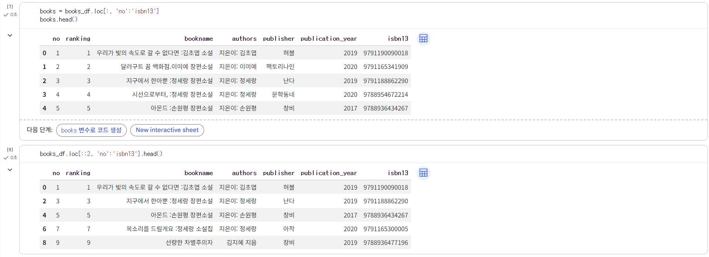
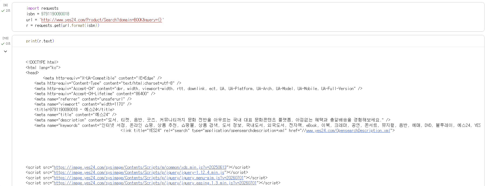
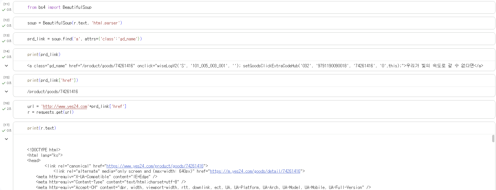
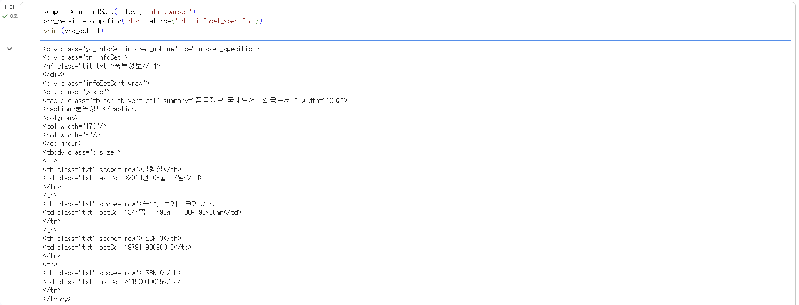
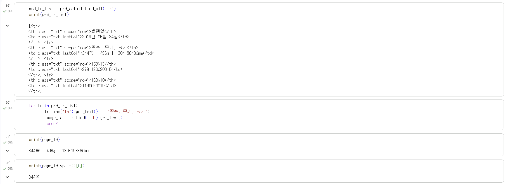
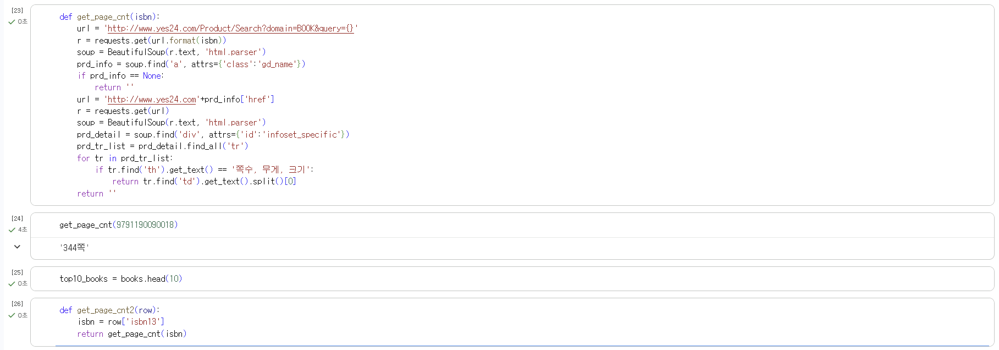
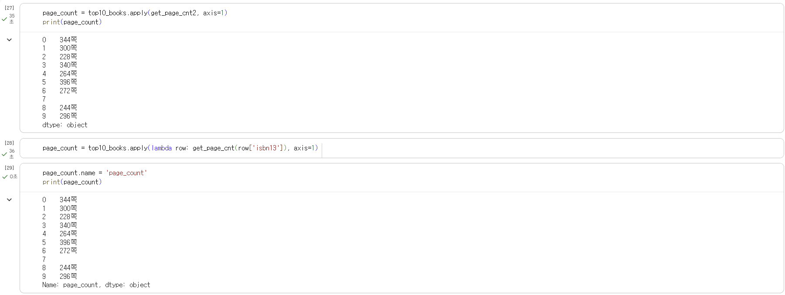
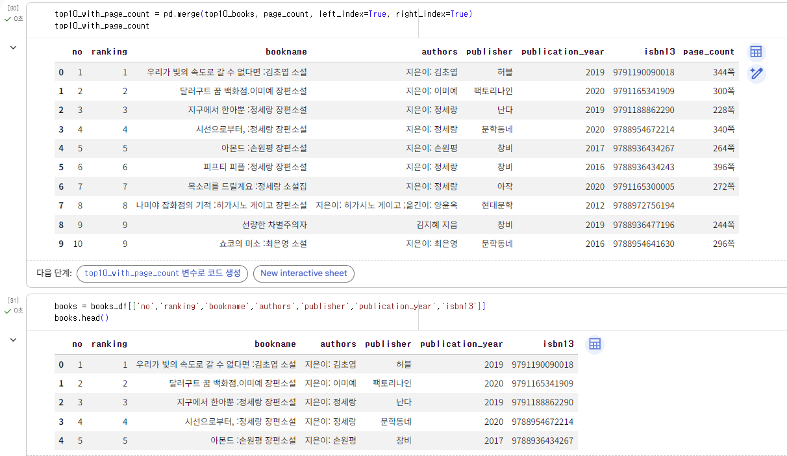
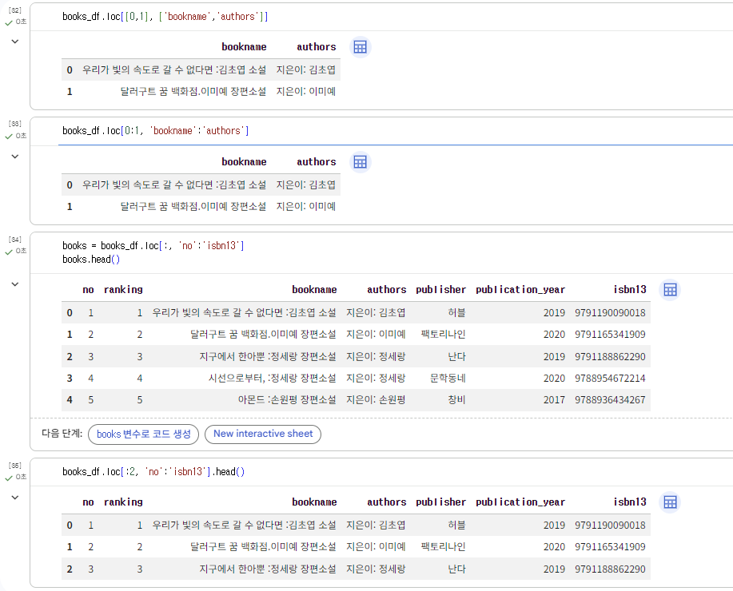


<br>
<br>

# 3️⃣ 확인 문제

## 문제 1.

> **🧚Q. 다음 중 BeautifulSoup 외에 웹 스크래핑에 사용할 수 있는 파이썬 패키지로 가장 적절한 것은 무엇인가요?**

```
1️⃣ NumPy  
2️⃣ Scrapy  
3️⃣ Matplotlib  
4️⃣ Scikit-learn  
```

```
정답 : 2
스크래피는 requests와 뷰티풀수프를 합쳐 놓은 것과 비슷하다.
```


### 🎉 수고하셨습니다.