# 데이터분석 3주차 정규과제

📌데이터분석 정규과제는 매주 정해진 분량의 『*혼자 공부하는 데이터 분석 with 파이썬*』 을 읽고 학습하는 것입니다. 이번 주는 아래의 **DataAnalysis_3rd_TIL**에 나열된 분량을 읽고 공부하시면 됩니다.

아래의 문제를 풀어보며 학습 내용을 점검하세요. 문제를 해결하는 과정에서 개념을 스스로 정리하고, 필요한 경우 제시된 강의를 참고하여 보완하는 것이 좋습니다.

<!-- 강의 링크는 아래와 같습니다.
https://www.youtube.com/watch?v=CE3_InvbmLY&list=PLVsNizTWUw7FGzSRCkQrPEEe-ljVXgS7k&index=6
https://www.youtube.com/watch?v=hhbzUEQWdTg&list=PLVsNizTWUw7FGzSRCkQrPEEe-ljVXgS7k&index=7
-->


## DataAnalysis_3rd_TIL

### 3장 데이터 정제하기
#### 01. 불필요한 데이터 삭제하기
#### 02. 잘못된 데이터 수정하기


## Study Schedule

| 주차  | 공부 범위     | 완료 여부 |
| ----- | ------------- | --------- |
| 1주차 | p.24~81    | ✅         |
| 2주차 | p.84~151   | ✅         |
| 3주차 | p.154~219  | ✅         |
| 4주차 | p.222~279 | 🍽️         |
| 5주차 | p.282~325 | 🍽️         |
| 6주차 | p.328~379 | 🍽️         |
| 7주차 | p.382~430 | 🍽️         |

<br>

<!-- 여기까진 그대로 둬 주세요-->


# 1️⃣ 개념 정리 

## 01. 불필요한 데이터 삭제하기

불필요한 데이터를 수정하는 것을 데이터 정제 또는 전처리하고 한다. 데이터가 업데이트되었을 때 다른 방식으로 데이터를 정제하거나 수정하면 분석할 수가 없기 때문에 데이터 정제 과정이 일정하게 유지되도록 수정 과정을 기록하는 것도 중요하다. 
loc 메서드에서 슬라이스 연산자로 전체 행을 선택하고 필요한 열을 선택한다. loc 메서드의 슬라이싱은 마지막 인덱스를 포함한다. 열을 전체 데이터 프레임에서 제거하고 싶을 때는 불리언 배열을 사용해서 손쉽게 선택해서 제외할 수 있다. 
drop 메서드의 두번째 매개변수 엑시스로 축을 지정하고 삭제할 수 있다. dropna() 메서드로 NaN이 들어있는 열을 모두 삭제할 수 있다. 인덱스로 지정하여 특정 행을 삭제할 수도 있다. 
모든 원소와 특정 값을 비교하여 그 값과 동일한 값을 출력하도록 불리언배열을 사용하여 출력할 수도 있다. 

dupliacated() 매서드는 중복된 행을 처리해준다. 
groupby() 매서드는 특 정 열을 기준으로 같은 데이터를 합칠 때 사용한다. 

## 02. 잘못된 데이터 수정하기

info 메서드는 데이터프레임에 있는 각 행, 열의 통계를 요약해서 보여주는 메서드로, 개수나 타입 뿐만 아니라 메모리 사용량까지 알려준다. 
isna 메서드는 비어있는 값을 True로 표시하고 sum으로 개수를 출력한다. 
Nan은 판다스에서 사용하는 특수한 타입인데, 주동소수점으로 저장이 된다. None으로 지정하면 판다스가 없는 값으로 인식하여 Nan으로 바꾸로 실수형으로 바꾼다. 하지만 문자열 타입에 넣으면 None 그대로 들어가기 때문에 np.nan으로 입력한다. 
fillna 메서드로 Nan을 다른 값으로 바꿀 수 있다. replace 메서드는 특정 값을 다른 값으로 바꿀 수 있다. Nan인 것도 바꿀 수 있고, 여러 값을 한 번에 바꿀 수도 있다. 

정규표현식은 아주 오래된 문자열 매핑 문법이다. \d는 0에서 9까지의 한 숫자에 대응된다. 네 자리 연도 하려면 \d\d\d\d으로 표현하고, 반복되는 값은 {숫자}로 표현할 수 있다. 일반 문자열과 구분하기 위해 앞에 r을 붙여 표현해야 하고 괄호로 묶으면 별도로 참조해서 사용하겠다고 선언하는 것으로 이 내용만 사용한다. 문자를 찾을 때는 마침표를 사용한다. 몇 개의 글자로 이루어져있는지 알기 어려울 때는 *를 사용하여 최대 매칭한다. 일반 문자라고 인식하게 하는 건 \, 띄어쓰기는 \s이다. 
contains 메서드가 인덱스의 의미를 이해하고 출력해준다. 


# 2️⃣ 수행 인증

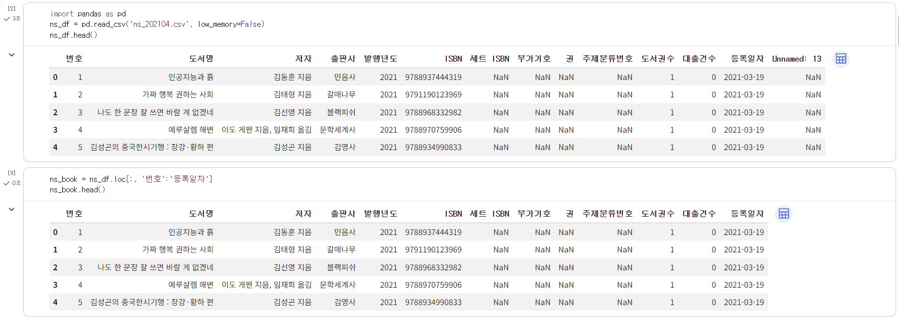
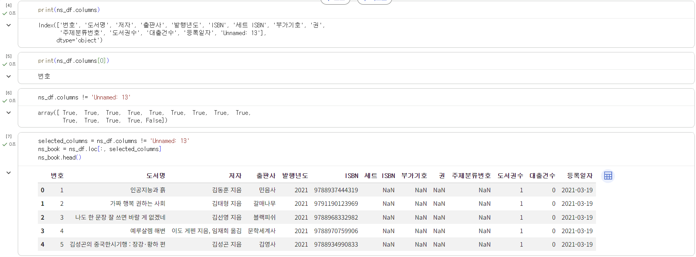
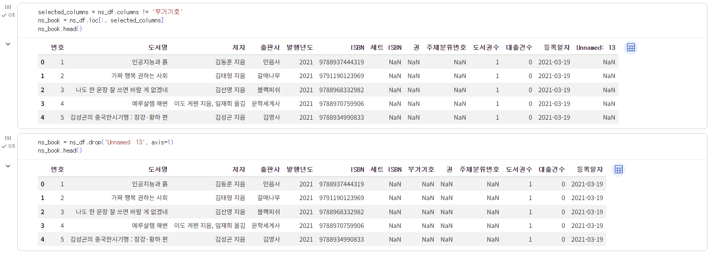
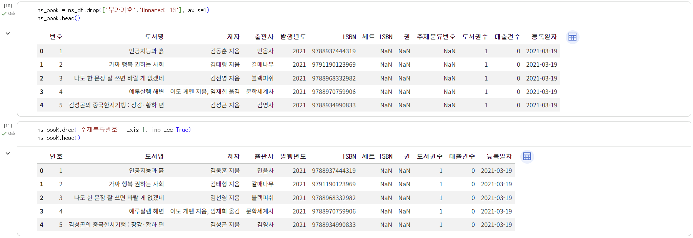
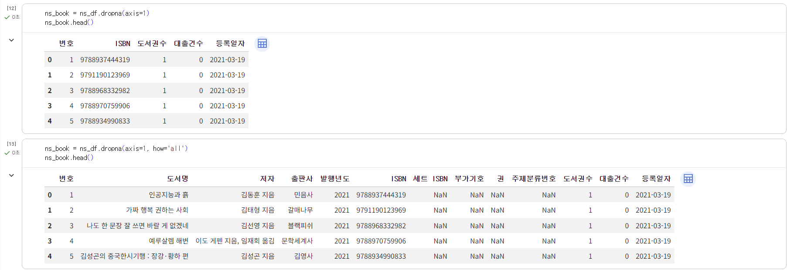
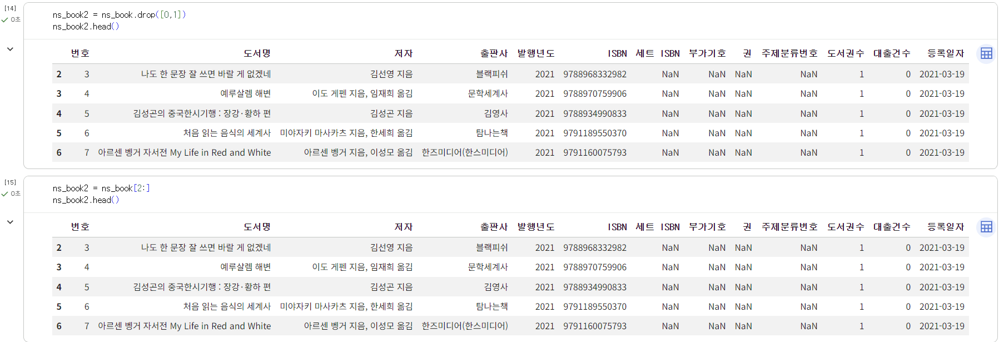
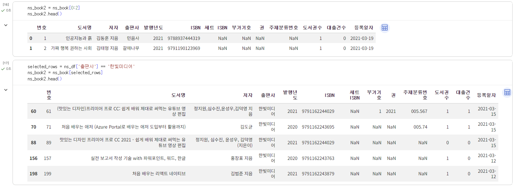
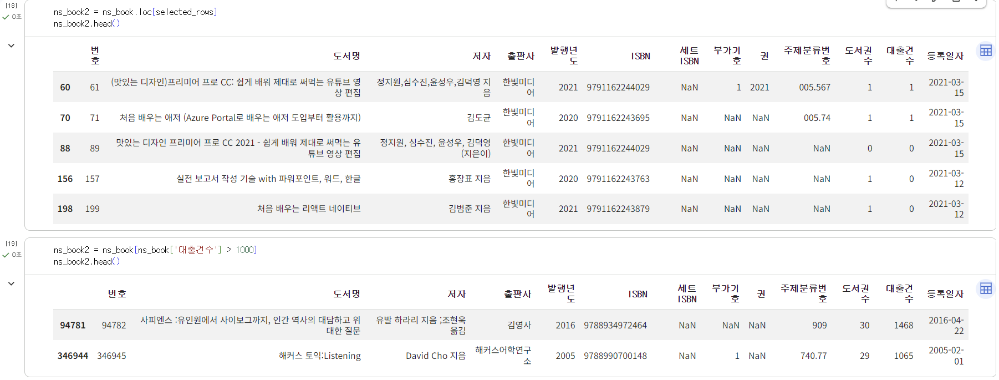
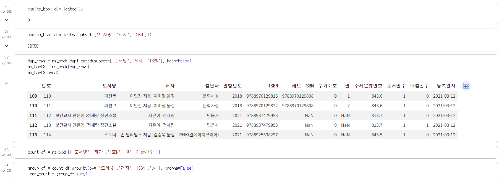
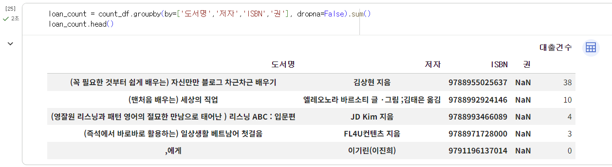
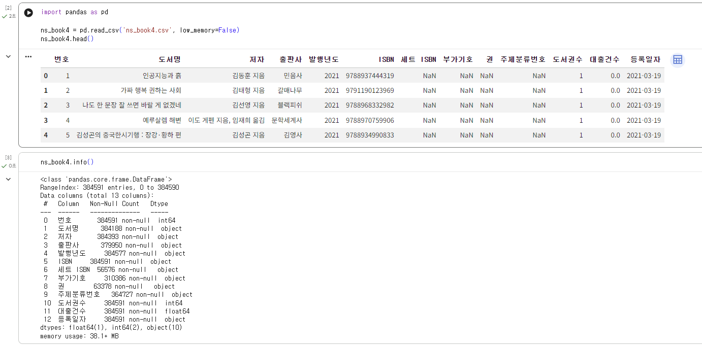
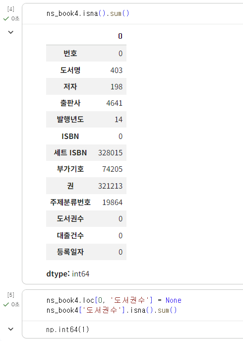
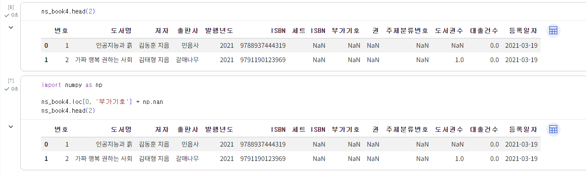
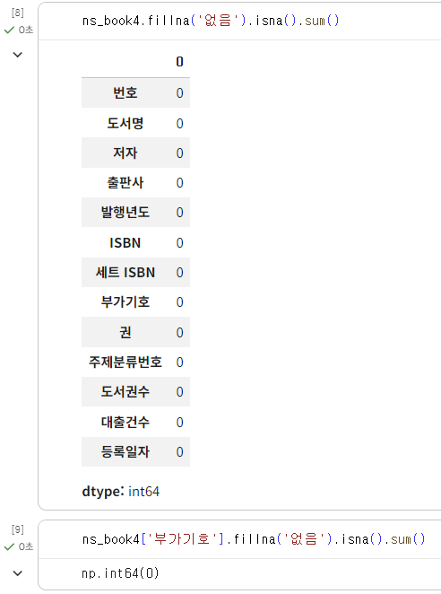
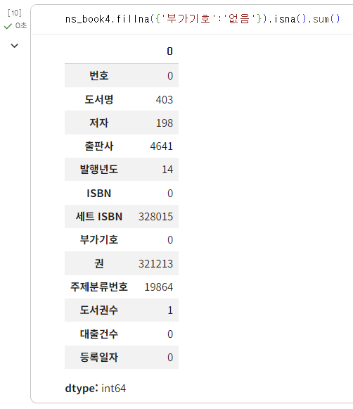
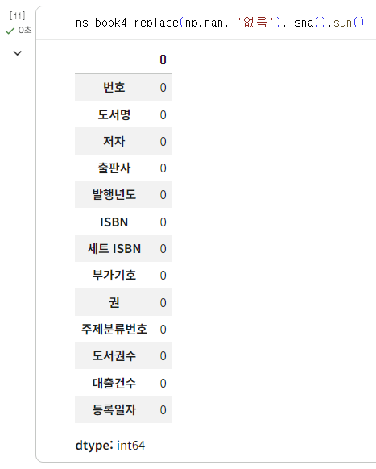
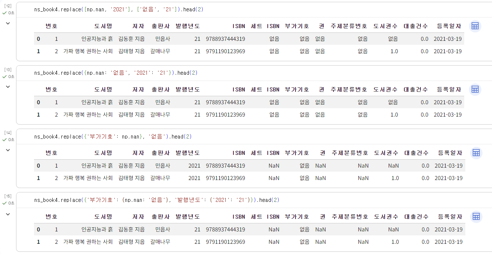
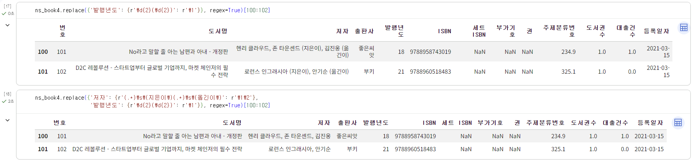
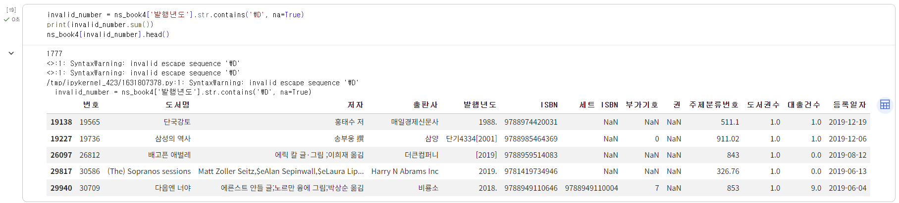
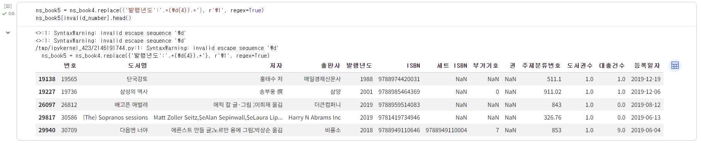
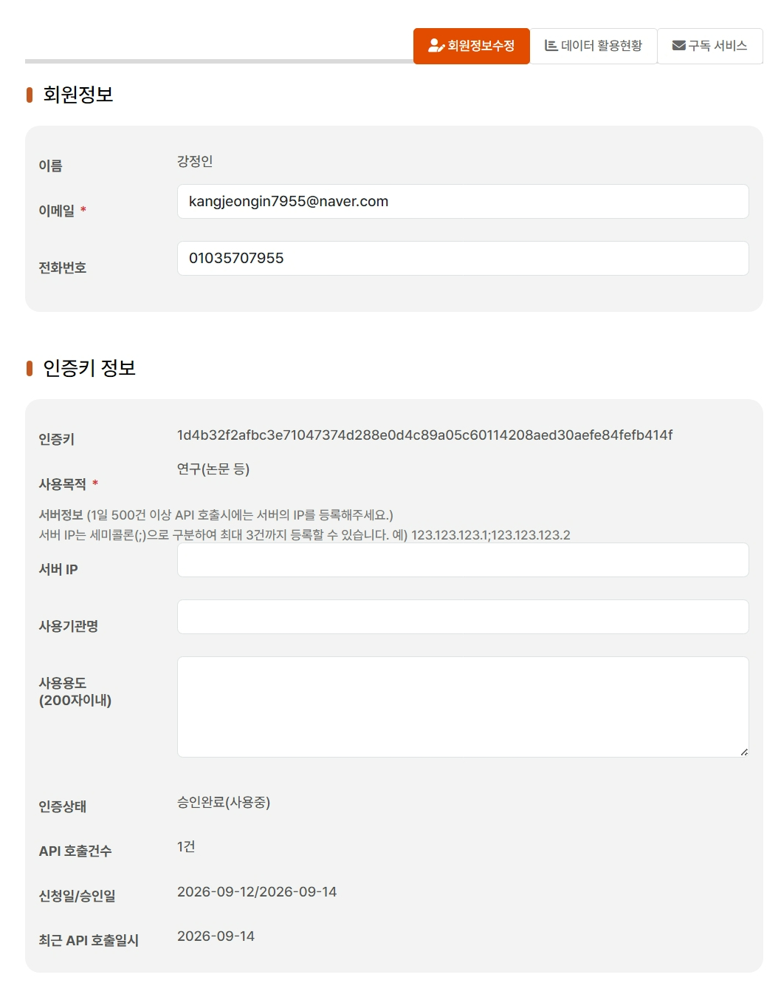


<br>
<br>

# 3️⃣ 확인 문제

## 문제 1.

> **🧚Q. 다음 두 데이터프레임 df1, df2를 합쳐서 데이터프레임 df3를 만들려고 합니다.**  
> 적절한 판다스 명령을 선택해주세요.

<table>
<tr>

<td>

### df1

| index | col1 | col2 |
|-------|------|------|
| 0     | x    | 5    |
| 1     | y    | 6    |
| 2     | z    | 7    |

</td>

<td>

### df2

| index | col3 | col4 |
|-------|------|------|
| 0     | x    | 50   |
| 1     | y    | 60   |
| 2     | w    | 70   |

</td>

<td align="center" valign="middle">

<h2> ➜ </h2>

</td>

<td>

### df3 (결과)

| index | col1 | col2 | col3 | col4 |
|-------|------|------|------|------|
| 0     | x    | 5.0  | x    | 50.0 |
| 1     | y    | 6.0  | y    | 60.0 |
| 2     | z    | 7.0  | NaN  | NaN  |
| 3     | NaN  | NaN  | w    | 70.0 |

</td>

</tr>
</table>

```
1️⃣ pd.merge(df1, df2)
2️⃣ pd.merge(df1, df2, how='left')
3️⃣ pd.merge(df1, df2, left_on='col1', right_on='col3', how='outer')
4️⃣ pd.merge(df1, df2, left_on='col1', right_on='col3', how='inner')
```

```
정답 : 3
1번과 2번은 기준이 없고, 겹치는 컬럼명이 없어 실행이 되지 않는다. 
4번은 두 데이터프레임에 모두 있는 값만 출력하여 z, w가 출력되지 않는다.
```


### 🎉 수고하셨습니다.