# 데이터분석 4주차 정규과제

📌데이터분석 정규과제는 매주 정해진 분량의 『*혼자 공부하는 데이터 분석 with 파이썬*』 을 읽고 학습하는 것입니다. 이번 주는 아래의 **DataAnalysis_4th_TIL**에 나열된 분량을 읽고 공부하시면 됩니다.

아래의 문제를 풀어보며 학습 내용을 점검하세요. 문제를 해결하는 과정에서 개념을 스스로 정리하고, 필요한 경우 제시된 강의를 참고하여 보완하는 것이 좋습니다.

<!-- 강의 링크는 아래와 같습니다.
https://www.youtube.com/watch?v=HNlRYQnLkek&list=PLVsNizTWUw7FGzSRCkQrPEEe-ljVXgS7k&index=8
https://www.youtube.com/watch?v=Cbk_tQtuhbM&list=PLVsNizTWUw7FGzSRCkQrPEEe-ljVXgS7k&index=9
-->


## DataAnalysis_4th_TIL

### 4장 데이터 요약하기
#### 01. 통계로 요약하기
#### 02. 분포 요약하기


## Study Schedule

| 주차  | 공부 범위     | 완료 여부 |
| ----- | ------------- | --------- |
| 1주차 | p.24~81    | ✅         |
| 2주차 | p.84~151   | ✅         |
| 3주차 | p.154~219  | ✅         |
| 4주차 | p.222~279 | ✅         |
| 5주차 | p.282~325 | 🍽️         |
| 6주차 | p.328~379 | 🍽️         |
| 7주차 | p.382~430 | 🍽️         |

<br>

<!-- 여기까진 그대로 둬 주세요-->


# 1️⃣ 개념 정리 

## 01. 통계로 요약하기

숫자를 사용해서 나타낸 방법, 어떤 통계값을 사용해서 데이터 전체를 요약하는 방법을 기술통계라고 한다. 

decribe() 메서드는 수치형 변수들을 요약해준다. 평균값, 표준편차, 최솟값, 최댓값, 중위값, 25%, 75%를 보여주고, 다른 위치에 있는 값을 알고 싶으면 퍼센트 매개변수에 값을 넣어 확인할 수 있다. include() 매개변수를 오브젝트라고 지정하여 문자열 데이터 타입의 데이터 개수, 고유 개수, 최빈값, 최빈값의 빈도수 등의 통계값을 요약해서 볼 수 있다. 

평균을 구할 때는 mean(), 중앙값을 구할 때는 median()을 사용하는데 데이터 개수가 짝수이면 중간 두 값을 평균낸 값이 중간값이다. 최솟값은 min(), 최댓값은 max(), 사분위수는 quantile()를 사용하는데 정확한 값이 없는 값을 계산할 때에는 보간으로 분위수에 비례하여 특정 위치의 값을 구한다. 역으로 어떤 숫자가 있을 때 몇 퍼센트에 위치한 값인지 알아내려면 불리언 배열을 사용하여 비율을 계산할 수 있다. 

분산은 데이터가 얼마나 퍼져있는 정도를 나타내는 것으로, var() 메서드를 사용한다. 데이터가 넓게 퍼져있을수록 분산이 커진다. 표준편차는 분산에 제곱근을 한 것으로 s라고 나타내고 std() 메서드를 사용한다. 판다스를 사용하여 표준편차를 계산할 때는 평균을 구하는 데 데이터를 사용했기 때문에 모두 다 독립된 샘플이 아니라 자유도가 하나 줄었다고 표현하여 n-1을 한다. 하지만 대부분 -1이 결과에 큰 영향을 미치지 않기 때문에 넘파이는 그냥 n으로 나눠서 계산한다. 

최빈값은 mode()로 확인할 수 있다. 

## 02. 분포 요약하기

산점도 scatter plot는 점으로 찍어서 2차원으로 데이터를 그리는 그래프로, matplotlib 패키지의 scatter() 함수로 그릴 수 있다. 많은 데이터를 산점도로 표현하여 겹쳐져서 얼만큼 겹쳐져있는지 잘 알아보기 어렵기 때문에 alpha 매개변수(0~1)를 지정하여 투명도를 조절할 수 있다.

히스토그램은 어떤 구간으로 나눠 그 구간에 몇 개의 값이 있는지(도수) 막대그래프로 나타내는 것으로 hist()를 사용한다. 이것을 테이블로 나타내면 도수분포표라고 한다. 기본적으로 10개의 구간으로 나누지만 bins 배개변수로 구간 개수를 변경할 수 있다. histogram_bin_edges() 함수를 사용하면 구간 값을 정확하게 얻을 수 있다. 

seed()를 지정하고 randn()로 동일한 랜덤 실수를 생성할 수 있다. 

한 구간의 도수가 너무 커서 다른 구간의 도수들이 잘 표현되지 않을 때는 로그 스케일을 적용하여 작은 값들을 상대적으로 부각시킬 수 있다. 

상자 수염 그래프는 사분위수의 값을 나타내는 것으로, boxplot() 함수를 사용한다. 하나의 데이터의 두 개 이상의 열의 값을 비교하고 싶을 때 유용하다. 


# 2️⃣ 수행 인증

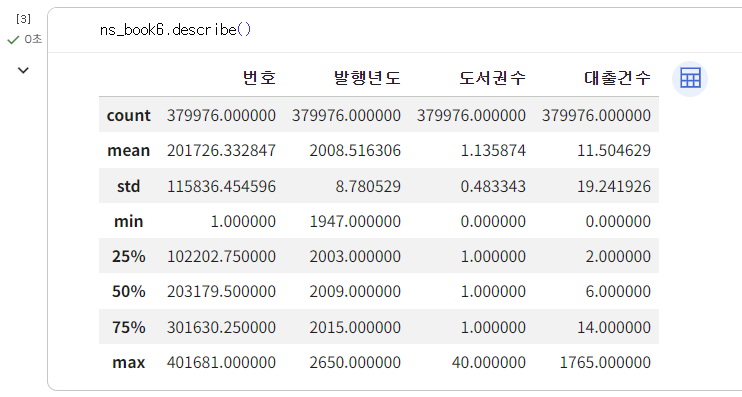
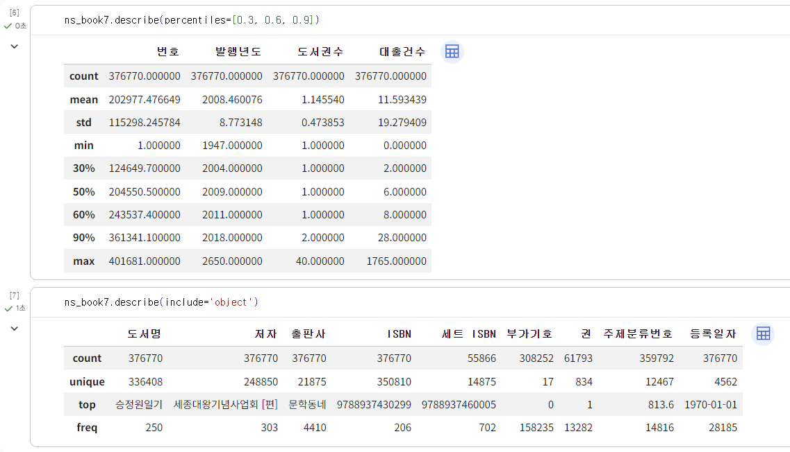
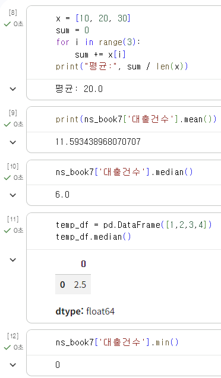
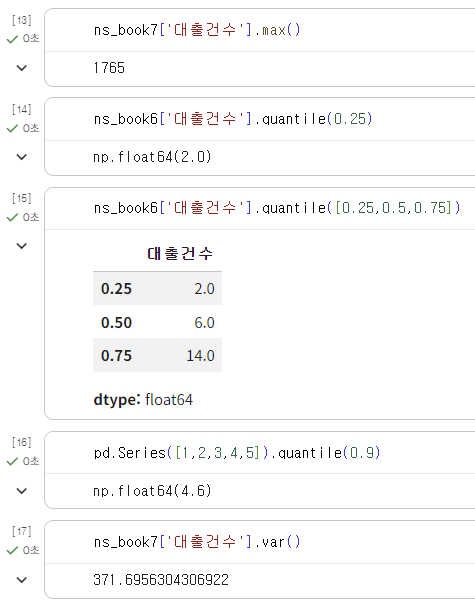
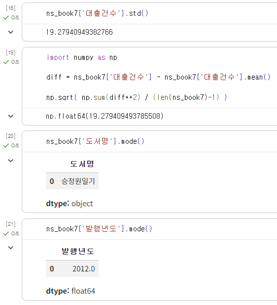
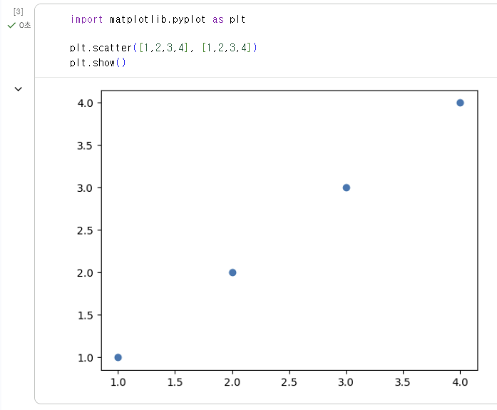
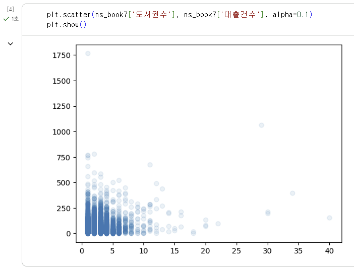
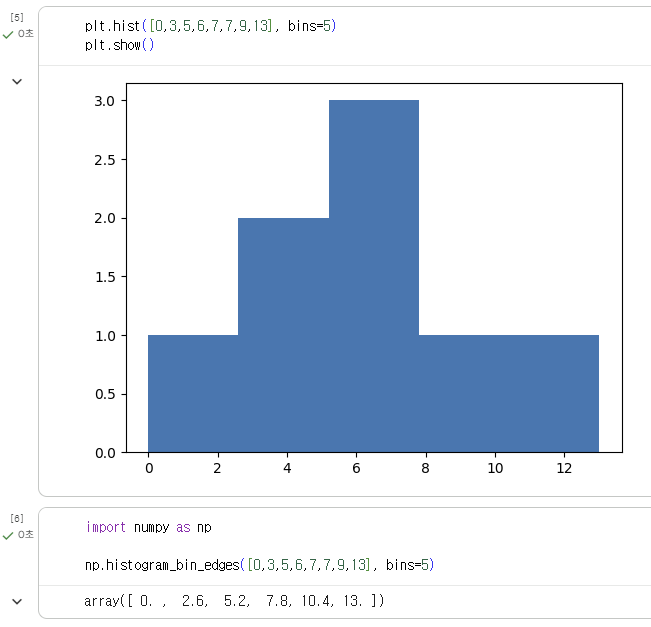
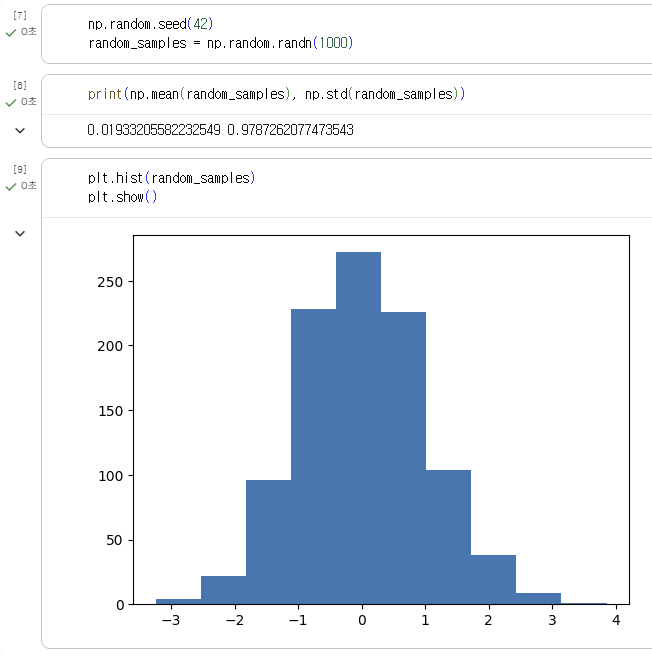
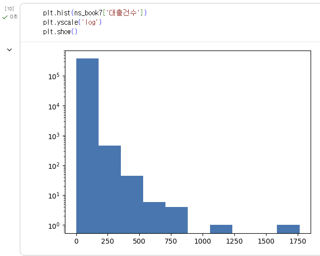
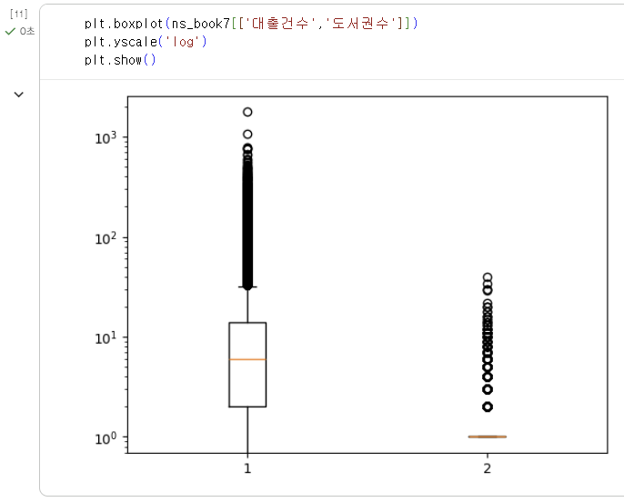
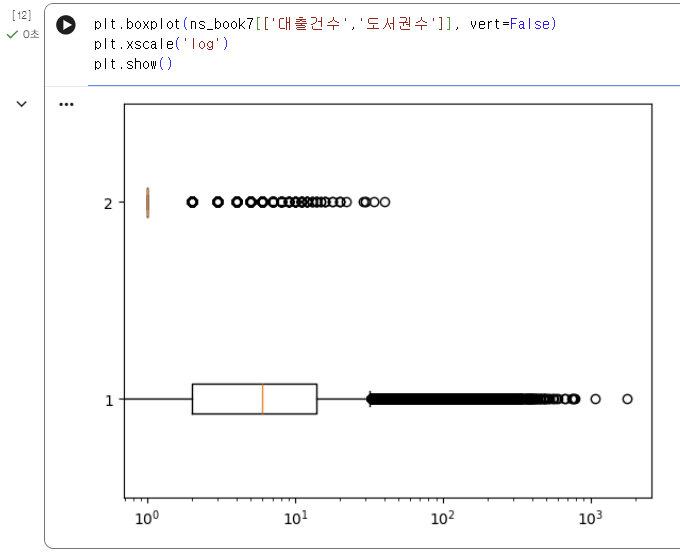


<br>
<br>

# 3️⃣ 확인 문제

## 문제 1.

> **🧚Q. 이번 주차에는 확인문제 대신 실습 과제를 진행합니다. 캐글에서 원하는 데이터셋을 선택하여 기술통계를 계산하고, 다양한 시각화를 수행해보세요.
작업은 코랩에서 진행한 뒤, 코랩 링크를 아래에 첨부해주세요.**

```
https://colab.research.google.com/drive/1ykHsdXlCvHbsk0vUfru_6misS3HgJZWs#scrollTo=d9718075
```


### 🎉 수고하셨습니다.