# 데이터분석 5주차 정규과제

📌데이터분석 정규과제는 매주 정해진 분량의 『*혼자 공부하는 데이터 분석 with 파이썬*』 을 읽고 학습하는 것입니다. 이번 주는 아래의 **DataAnalysis_5th_TIL**에 나열된 분량을 읽고 공부하시면 됩니다.

아래의 문제를 풀어보며 학습 내용을 점검하세요. 문제를 해결하는 과정에서 개념을 스스로 정리하고, 필요한 경우 제시된 강의를 참고하여 보완하는 것이 좋습니다.

<!-- 강의 링크는 아래와 같습니다.
https://www.youtube.com/watch?v=ho0LZ6GWhtc&list=PLVsNizTWUw7FGzSRCkQrPEEe-ljVXgS7k&index=10
https://www.youtube.com/watch?v=deYY4xHsI0o&list=PLVsNizTWUw7FGzSRCkQrPEEe-ljVXgS7k&index=11
-->


## DataAnalysis_5th_TIL

### 5장 데이터 시각화하기
#### 01. 맷플롯립 기본 요소 알아보기
#### 02. 선 그래프와 막대 그래프 그리기


## Study Schedule

| 주차  | 공부 범위     | 완료 여부 |
| ----- | ------------- | --------- |
| 1주차 | p.24~81    | ✅         |
| 2주차 | p.84~151   | ✅         |
| 3주차 | p.154~219  | ✅         |
| 4주차 | p.222~279 | ✅         |
| 5주차 | p.282~325 | ✅         |
| 6주차 | p.328~379 | 🍽️         |
| 7주차 | p.382~430 | 🍽️         |

<br>

<!-- 여기까진 그대로 둬 주세요-->


# 1️⃣ 개념 정리 

## 01. 맷플롯립 기본 요소 알아보기

Figure 객체는 그래프의 모든 구성요소를 관장하는 최상위 객체로, scatter 함수 등으로 그래프를 그리면 자동으로 생성된다. figure() 함수를 사용해서 명시적으로 피겨 객체를 만들 수 있는데, 명시적으로 만들면 그림의 상세한 옵션들을 자세하게 제어할 수 있다. figsize 매개변수에 인치 단위로 너비와 높이의 크기를 지정할 수 있고, alpha 매개변수로 투명도를 줄 수 있다. 실제 화면에 그려지는 크기를 재보면 컴퓨터마다 사양이 달라(기본 dpi 72) 지정한 인치 값과 다를 수 있어 픽셀로 입력(인치/72)하면 2차 가공할 때 편할 수 있다. dpi 매개변수를 수정하면 그래프 안의 레이블, 축 이름, 제목 등이 함께 커진다, 

rcParams는 figsize와 dpi 기본값을 확인하거나 변경할 수 있다. scatter.maker로 산점도 마커 기본값('o')을 확인하거나 변경할 수 있다. 모든 옵션이 함수나 메서드에서 제공되는 것은 아니지만, marker는 scatter()의 marker 매개변수에서 따로 지정할 수 있다. 

서브플롯이 두 개 있다 = Axes 객체가 두 개 있다
subplots() 함수로 서브플롯을 생성한다. 각 서브플롯에 개별적으로 접근해서 옵션을 지정할 수 있다. subplots(행 개수), subplots(행 개수, 열 개수)로 배치할 수 있다. (예 : subplots(2)은 세로로, subplots(1, 2)은 가로로 나란히 배치)

## 02. 선 그래프와 막대 그래프 그리기

선 그래프는 각 데이터 포인트를 연결해서 그리는 그래프로, plt.plot() 함수를 사용한다. 첫 번째 매개변수는 x축 값, 두 번째 매개변수는 y축 값을 전달한다. Axes 객체에서 쓰는 메서드는 set_이 붙지만 plt. 아래에서 쓰는 함수는 그냥 사용한다. 라인 스타일을 점선, 쇄선, 파선, 실선 등 다양한 종류로 변경할 수 있고, 마커, 라인, 색깔을 각각 매개변수를 합쳐서 하나의 문자열로 전달할 수 있다. annotate() 함수로 그래프에 값을 표시할 수 있고, xticks() 함수로 눈금을 추가할 수 있다. 보통 마커 위치에 y축 값을 텍스트로 표시해서 값을 눈으로 어림잡기 쉽게 해준다. 하지만 모든 마커에 텍스트를 출력하면 겹쳐서 보이지 않기 때문에 적당히 데이터 개수를 건너뛰면서 출력할 수 있게 한다. 기본적으로 텍스트의 왼쪽 아래 부분이 마커의 정확한 중심에 맞춰있어 마커와 겹쳐 잘 안 보일 수 있는데, 이럴 때 xytext로 지정된 idx와 val 위치에서 얼마만큼 떨어질지 지정할 수 있다. 절대 좌표값으로 떨어진 거리를 지정할 수 있지만, x축과 y축의 스케일이 서로 달라 적절한 값을 찾기 애매할 때 textcoords 매개변수를 이용하여 offset을 포인트 단위, 픽셀 단위로 지정하여 상대적인 위치를 지정할 수 있다. 

막대 그래프는 plt.bar() 함수로 그린다. 선 그래프는 보통 x축이 정수인 경우가 많아 값의 변화나 추세를 보기에 좀 더 용이하고, 막대그래프는 x축이 범주형 데이터인 경우가 많아 값이 큰 것부터(또는 작은 것부터) 정렬해서 서로 비교하기 좋다. annotate로 텍스트를 표시할 때 막대 그래프는 표현할 값이 많지 않기 때무에 모든 막대에 다 표시한다. 텍스트 기본적으로 막대의 중심에서 시작하기 때문에 텍스트가 오른쪽으로 삐져나온 것처럼 보일 수 있어 옮겨주기도 한다. ha 매개변수를 'center'로 주면 텍스트가 막대 중앙에 정렬된다.(기본값은 'right') 텍스트 폰트가 커서 옆 막대를 침범할 때는 폰트 크기를 줄이거나 색깔을 구분되게 바꾸어 표현하기도 한다. width로 막대 너비를 조절할 수도 있다.

barh() 함수 사용하여 가로 막대그래프를 그릴 수 있다. 두께가 높이 방향이 되기 때문에 막대의 두께를 조정하려면 height를 조정해야 하고, annotate에서도 va로 정렬해야 한다. 


# 2️⃣ 수행 인증

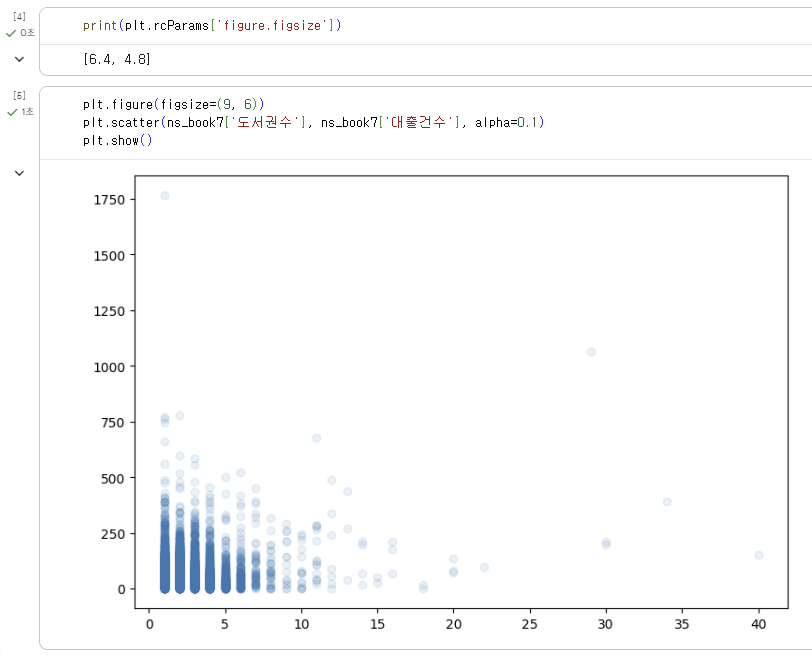
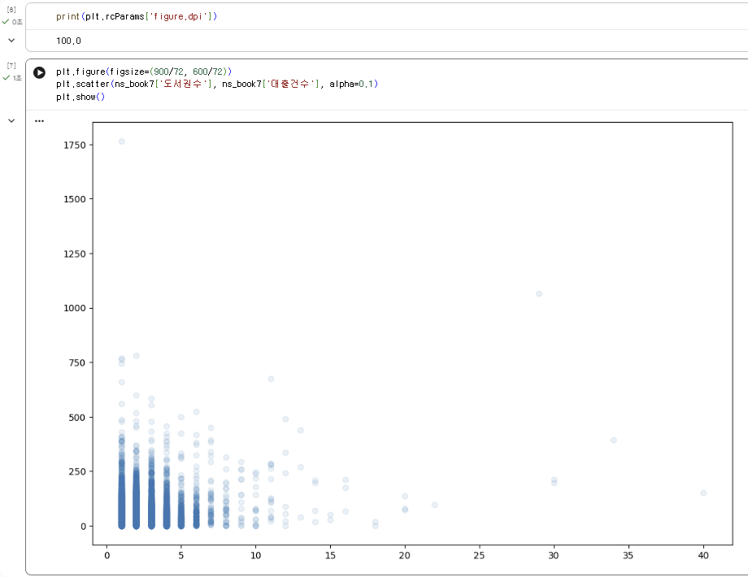
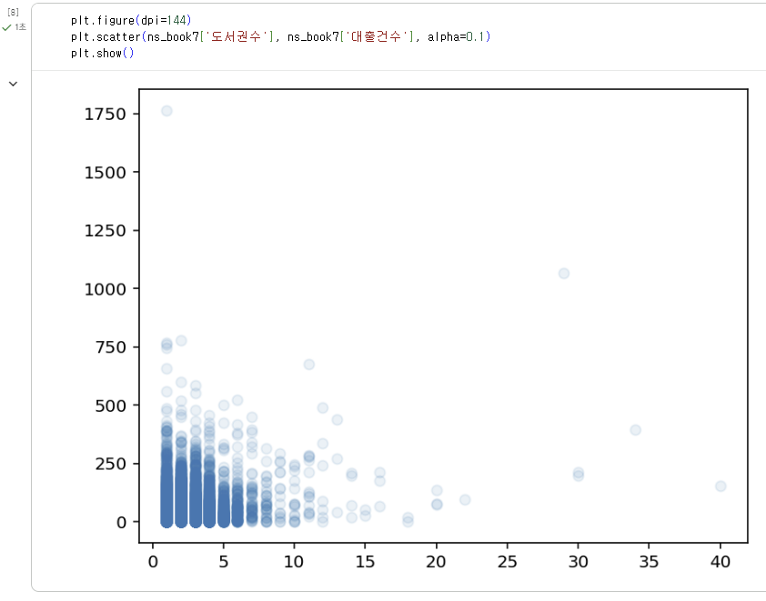
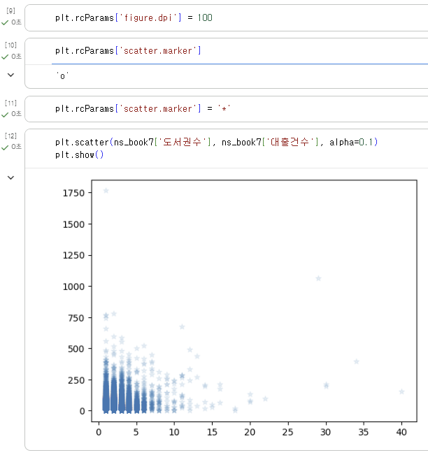
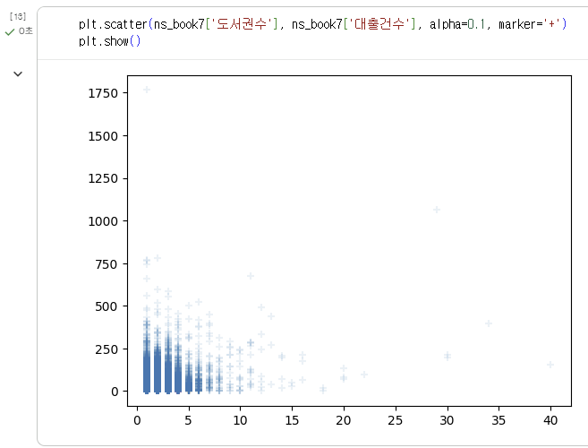
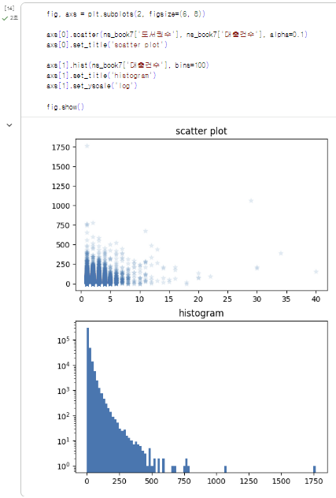
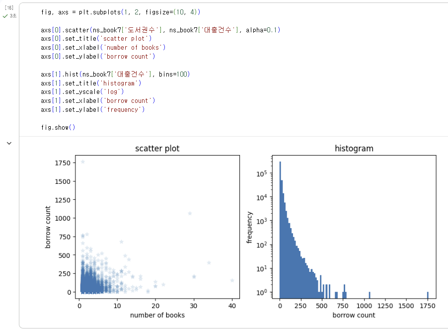
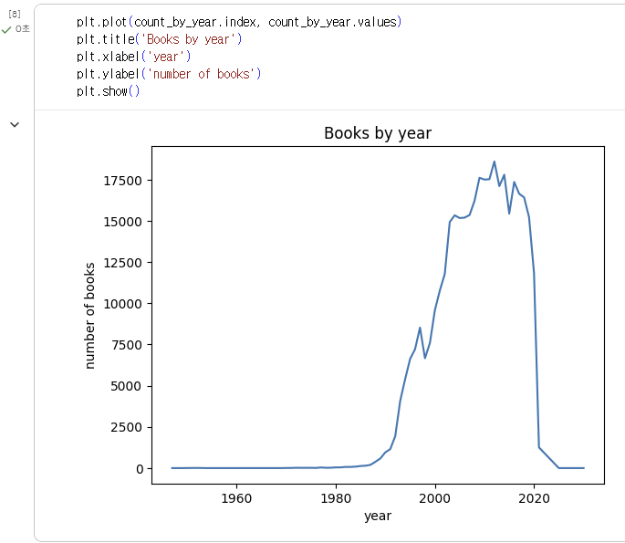
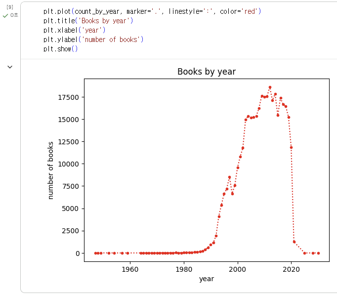
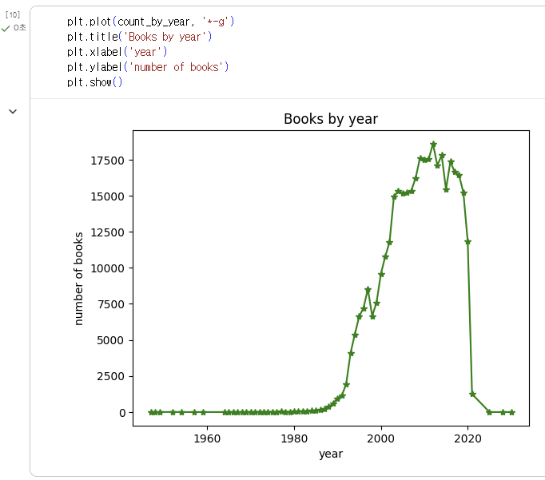
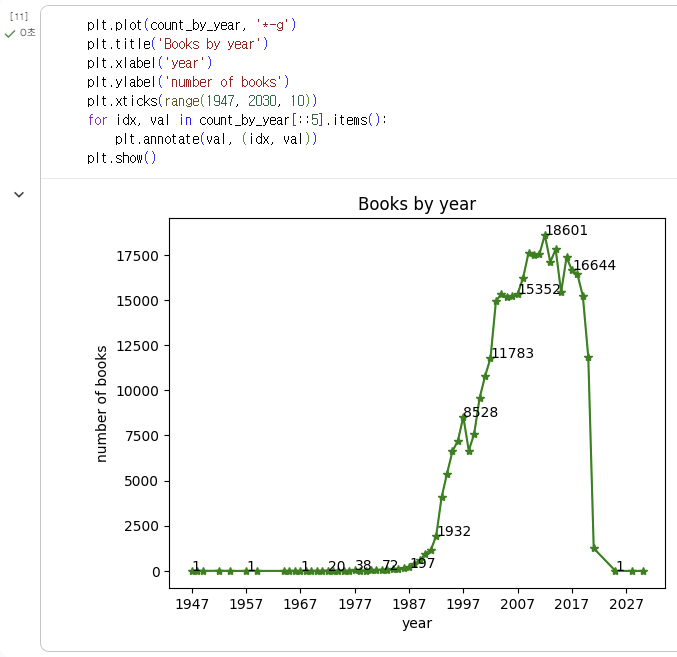
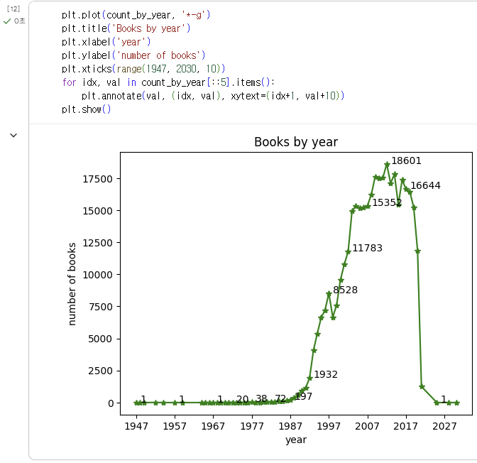
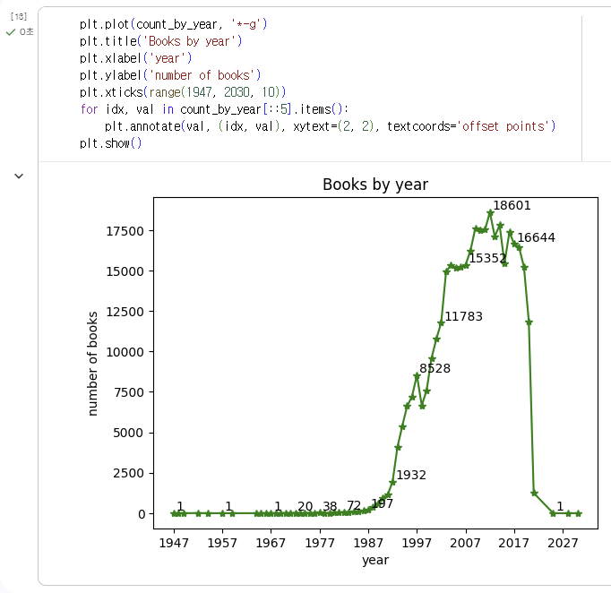
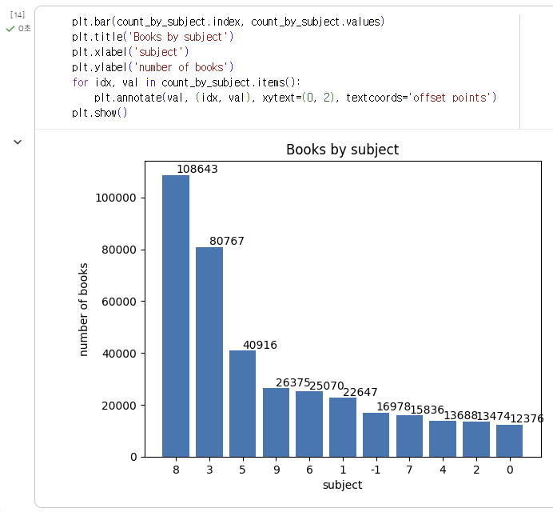
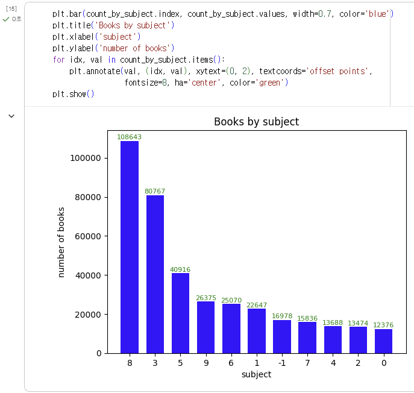
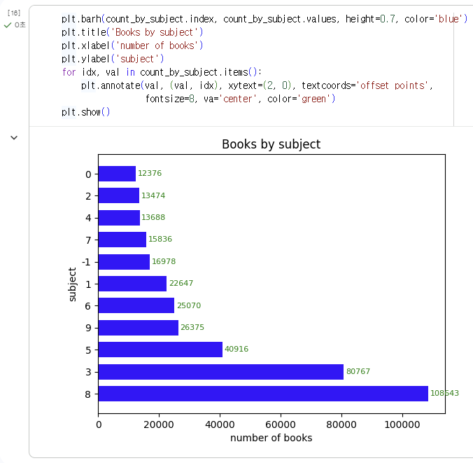


<br>
<br>

# 3️⃣ 확인 문제

## 문제 1.

> **🧚Q. 다음 데이터를 이용하여 matplotlib으로 선그래프를 그리는 코드를 작성해주세요.**
- x = [1, 2, 3, 4, 5]
- y = [2, 4, 6, 8, 10]
> 조건은 아래와 같습니다.
```
1️⃣ 제목은 "Linear Trend"로 설정해주세요.
2️⃣ x축 이름은 "X values"로 설정해주세요.
3️⃣ y축 이름은 "Y values"로 설정해주세요.
4️⃣ 마커(marker)를 포함하여 선그래프를 그려주세요.
```

```
import matplotlib.pyplot as plt

x = [1, 2, 3, 4, 5]
y = [2, 4, 6, 8, 10]

plt.plot(x, y, marker='*')
plt.title("Linear Trend")
plt.xlabel("X values")
plt.ylabel("Y values")
plt.show()
```


### 🎉 수고하셨습니다.