# SQL_ADVANCED 3주차 정규 과제 

📌SQL_ADVANCED 정규과제는 매주 정해진 분량의 『*혼자 공부하는 SQL*』 을 읽고 학습하는 것입니다. 이번주는 아래의 **SQL_ADVANCED_3rd_TIL**에 나열된 분량을 읽고 공부하시면 됩니다.

아래의 문제를 풀어보며 학습 내용을 점검하세요. 문제를 해결하는 과정에서 개념을 스스로 정리하고, 필요한 경우 제시된 강의를 참고하여 보완하는 것이 좋습니다.

<!-- 강의 링크는 아래와 같습니다.
https://www.youtube.com/watch?v=1YmWy-7-OhQ&list=PLVsNizTWUw7GCfy5RH27cQL5MeKYnl8Pm&index=10
https://www.youtube.com/watch?v=tuQFkzjqEGw&list=PLVsNizTWUw7GCfy5RH27cQL5MeKYnl8Pm&index=11
https://www.youtube.com/watch?v=IOCsreDYqFE&list=PLVsNizTWUw7GCfy5RH27cQL5MeKYnl8Pm&index=12
-->

**교재 실습 예제 파일은 08_SQL_ADVANCED_Template 레포지토리의 src 폴더에 업로드되어 있습니다. market_db 파일도 해당 폴더에 함께 포함되어 있으니 참고하시기 바랍니다.**

**👀(수행 인증샷은 필수입니다.)** 

## SQL_ADVANCED_3rd_TIL

### 4장 SQL 고급 문법
#### 01. MySQL의 데이터 형식
#### 02. 두 테이블을 묶는 조인
#### 03. SQL 프로그래밍 


## Study Schedule

| 주차  | 공부 범위     | 완료 여부 |
| ----- | ------------- | --------- |
| 1주차 | p.24~99    | ✅         |
| 2주차 | p.102~155   | ✅         |
| 3주차 | p.158~213  | ✅         |
| 4주차 | p.216~271 | 🍽️         |
| 5주차 | p.274~327 | 🍽️         |
| 6주차 | p.330~369 | 🍽️         |
| 7주차 | p.372~407 | 🍽️         |


<br>

<!-- 여기까진 그대로 둬 주세요-->

---

# 1️⃣ 학습 내용 정리

## 1. MySQL의 데이터 형식

정수형은 INT(4바이트, -21억~21억)를 많이 사용하지만 나이와 같은 큰 범위가 필요하지 않은 경우에는 더 적은 바이트를 사용하는 더 적은 범위의 형식을 사용하는 것이 효율적이다. 

문자형에서 CHAR는 속도가 조금 더 향상되지만 VARCHAR는 공간을 효율적으로 사용할 수 있다. 글자 크기가 고정되어 있으면 CHAR, 가변적이면 VARCHAR를 사용하는 것이 좋다. 전화번호는 맻 앞자리가 0으로 시작하여 CHAR를 사용하는 것이 좋다. 

대량 데이터에서 LONGTEXT는 긴 문장, LOBGBLOB은 큰 파일을 넣을 수 있다.

실수형은 일반적으로 FLOAT를 사용하고, 날짜형은 DATETIME이 무난하지만 상황에 따라 필요한 것만 사용하는 것이 좋다. 

SET @변수이름 = 변수값 하면 이름 정할 수 있지만 임시로 사용하는 거라 워크벤치를 닫으면 저장되지 않는다. 

LIMIT에는 변수를 사용할 수 없어 PREPARE와 EXECUTE를 활용하여 사용할 수 있다. 

CAST, CONVERT를 통해 값을 명시적으로 데이터 형을 변환할 수 있고, 형 변환 지정하지 않아도 암시적으로 형 변환을 할 수 있다. 

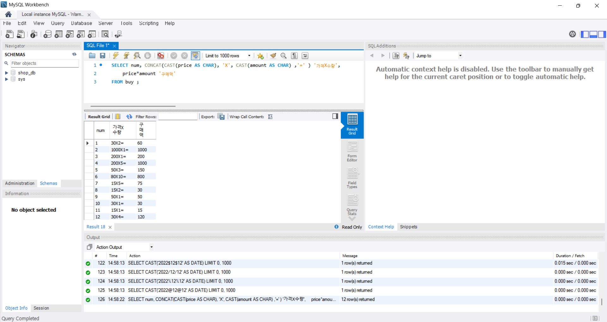

> **확인문제: 다음 보기에서 데이터 형식의 변환에 사용되는 함수를 2개 고르세요.**

보기는 아래와 같습니다.
```
CONVERT() / DATA() / CAST() / MOVE() / TYPE() / SUM() / AVG() / CURRENT_DATE()
```

```
CONVERT(), CAST()
```


## 2. 두 테이블을 묶는 조인

두 개의 테이블을 묶는 것을 조인이라고 한다.

내부 조인이 가장 많이 사용된다. 일대다에서 일은 Primary key - 다는 외래 키로 맺어진다. 
SELECT 열 목록
FROM 첫 번째 테이블
	INNER JOIN 두 번째 테이블
	ON 조인절 조건
[WHERE 결측 조건]

외부 조인
SELECT 열 목록
FROM 첫 번째 테이블(LEFT)
	LEFT or RIGHT or FULL OUTER JOIN 두 번째 테이블(RIGHT)
	ON 조인절 조건
[WHERE 결측 조건]

CROSS JOIN은 내용적인 의미는 없지만 대용량 데이터 생성할 때 사용한다. ON 구문 사용할 수 없다. 

SELF JOIN 자체 조인은 테이블을 복사해서 사용하는 것이다. 

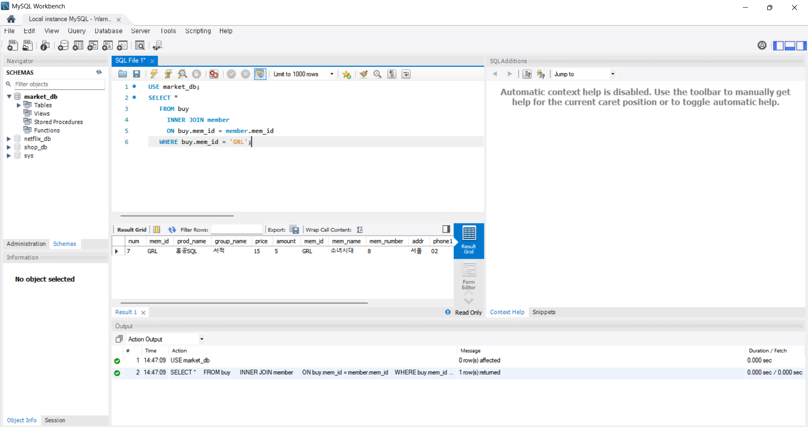
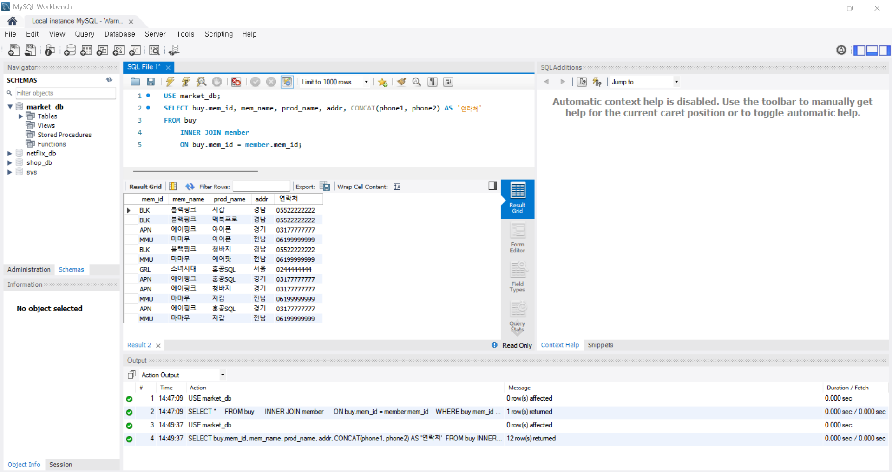
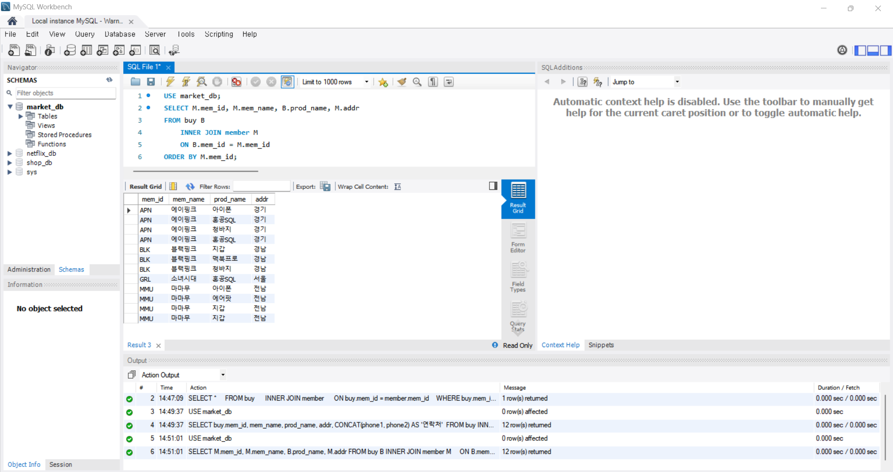
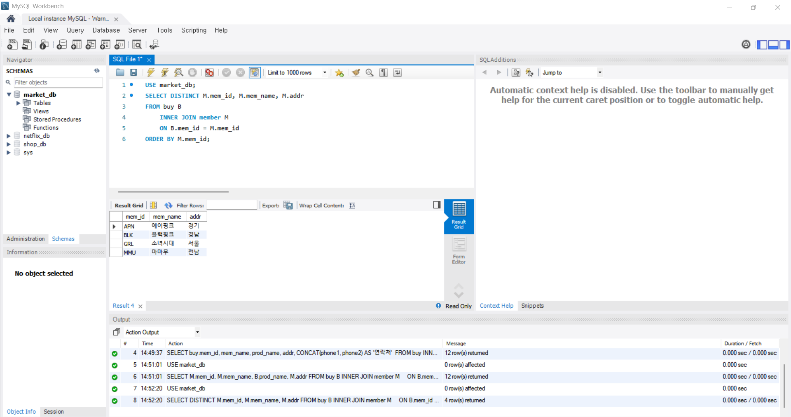
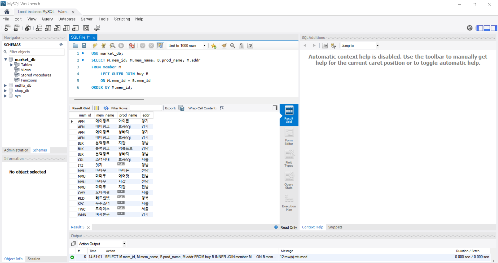

> **확인문제: 다음 SQL은 회원으로 가입만 하고, 한 번도 구매한 적이 없는 회원의 목록을 조회하는 쿼리입니다. 빈칸에 들어갈 가장 적절한 구문을 고르세요..**

```sql
SELECT DISTINCT M.mem_id, B.prod_name, M.mem_name, M.addr
  FROM member M
    LEFT OUTER JOIN buy B
    ON M.mem_id = B.mem_id
  __________
  ORDER BY M.mem_id;
```
보기는 아래와 같습니다.
```
1. JOIN B.prod_name IS NULL
2. LIMIT B.prod_name IS NULL
3. HAVING B.prod_name IS NULL
4. WHERE B.prod_name IS NULL
```
```
정답 : 4
member를 기준으로 JOIN 하면 구매 기록이 없는 회원은 NULL로 채워진다. 그 결과에서 prod_name이 NULL인 경우를 필터링하면 구매 기록이 없는 회원만 출력된다. 
```

## 3. SQL 프로그래밍 

IF문은 조건문으로, 조건에 참이면 실행하는 것이다. 
IF 조건식 THEN
	~~~
END IF;

IF ~ ELSE문은 참일 때와 거짓일 때 각각의 문장을 실행하는 것이고, CASE문은 여러 가지 종류로 분기할 때 사용할 수 있다. 여러 조건들을 넣을 수 있다. 

WHILE 조건식이 참인 경우에 문장이 계속 실행이 반복된다. ITERATE는 다시 반복문으로 올라가고, LEAVE는 반복문을 빠져나간다. 

동적 SQL은 고정시켜놓지 않도록 PREPARE로 준비해놓고 EXECUTE로 실행하여 실시간으로 변형하여 만든다. 끝나면 DEALLOCATE로 해체해준다. 

> **확인문제: 다음은 CASE 문의 형식입니다. 빈칸에 들어갈 가장 적절한 명령어를 보기에서 고르세요..**

```sql
CASE
    (1) 조건 THEN
        SQL문장들1
    ELSE
        SQL문장들4
END (2);
```

보기는 아래와 같습니다.
```
WHEN / THEN / CURRENT / DATE / TIME / IF / END IF / CASE
```

```
여기에 답을 적어주세요!
(1) WHEN
(2) CASE
```


---

# 2️⃣ 실습과제

## 1. 데이터베이스 구축

아래 코드를 MySQL Workbench에 붙여넣은 후,  
**전체 드래그 → 실행 (Ctrl + shift + Enter)** 하여 데이터베이스를 구축하세요.

```sql
-- 1. 데이터베이스 생성
CREATE DATABASE IF NOT EXISTS week3_db;

-- 2. 사용할 데이터베이스 선택
USE week3_db;

-- 3. 기존 테이블 삭제 (초기화용)
DROP TABLE IF EXISTS orders;
DROP TABLE IF EXISTS customers;

-- 4. 테이블 생성 (조인 실습용)
CREATE TABLE customers (
    customer_id INT PRIMARY KEY,
    name VARCHAR(20),
    signup_date_str VARCHAR(8) 
);

CREATE TABLE orders (
    order_id INT PRIMARY KEY,
    customer_id INT,           
    order_date_str VARCHAR(8), 
    amount_str VARCHAR(10)     
);

-- 5. 데이터 삽입
INSERT INTO customers VALUES
(1, '신영', '20241528'),
(2, '경모', '20220261'),
(3, '세원', '20203401'),
(4, '진우', '20221024'),
(5, '성환', '20225100'),
(6, '혜준', '20244946'),
(7, '채은', '20250412'),
(8, '다나', '20212774'); -- 주문 없는 고객(외부 조인용)

INSERT INTO orders VALUES
(101, 1, '20240220', '12000'),
(102, 1, '20240303', '30000'),
(103, 2, '20240111', '15000'),
(104, 3, '20221201', '9000'),
(105, 5, '20231111', '20000'),
(106, 7, '20220707', '5000'),
(107, 99, '20240210', '7000'); -- 고객 테이블에 없는 customer_id (외부 조인용)
```

## 2. 실습 문제

다음 SQL 문을 작성하고 실행 결과를 확인 후 인증 사진을 아래에 업로드하세요.

1. **데이터 형식 변환**
   - orders 테이블의 `order_date_str`을 DATE 형식으로 변환하여 조회하시오.
   (힌트: STR_TO_DATE 사용)
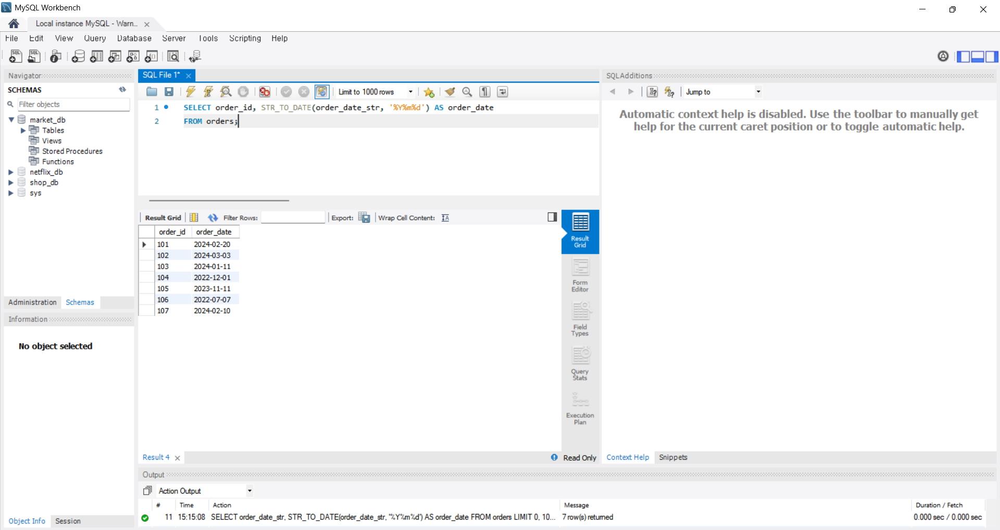

2. **데이터 형식 변환**
   - orders 테이블의 `amount_str`을 숫자형으로 변환하여 조회하시오.
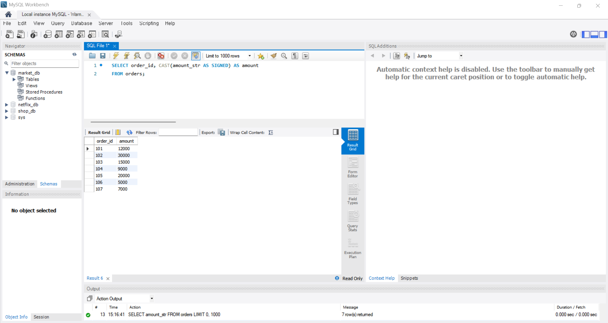

3. **내부 조인 (INNER JOIN)**
   - customers와 orders를 customer_id 기준으로 내부 조인하여
     고객 이름(name)과 주문 번호(order_id)를 함께 조회하시오.
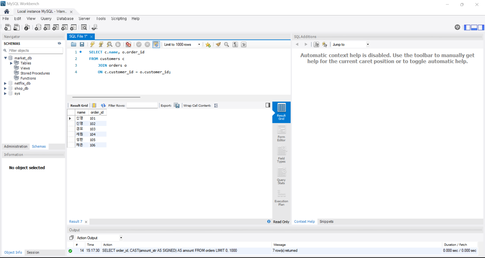

4. **외부 조인 (LEFT JOIN)**
   - customers를 기준으로 LEFT JOIN을 수행하여,
     주문이 없는 고객도 함께 조회하시오.
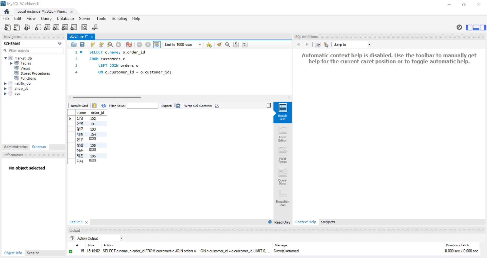

5. **스토어드 프로시저 (IF문 사용)**
   - 입력받은 금액이 10000 이상이면 '고액 주문',
     그렇지 않으면 '일반 주문'을 출력하는
     프로시저를 생성하시오.
   - 생성 후 CALL로 실행 결과를 확인하시오.
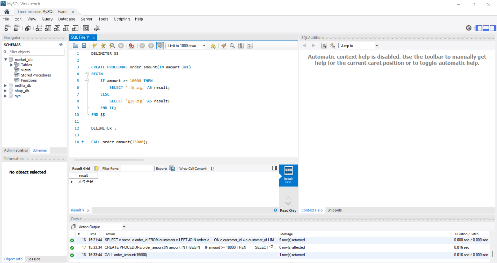
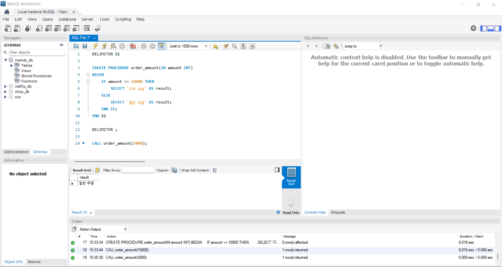

### 🎉 수고하셨습니다.


