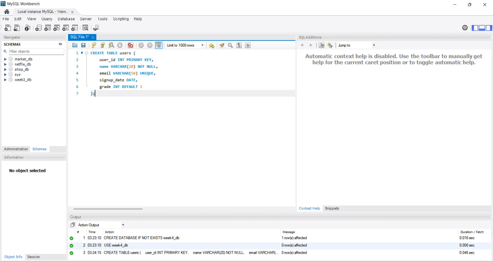
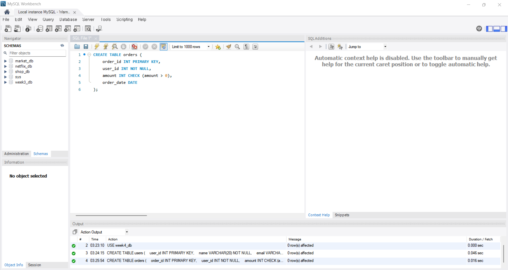
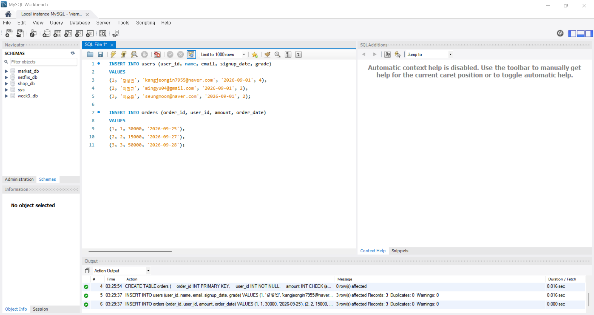
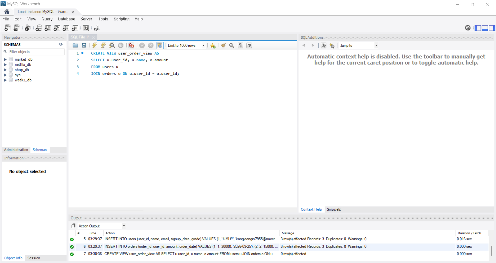
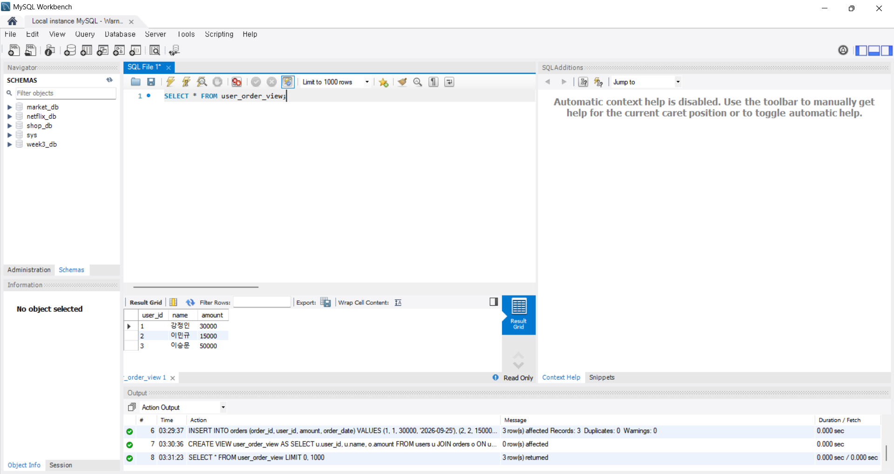

# SQL_ADVANCED 4주차 정규 과제 

📌SQL_ADVANCED 정규과제는 매주 정해진 분량의 『*혼자 공부하는 SQL*』 을 읽고 학습하는 것입니다. 이번주는 아래의 **SQL_ADVANCED_4th_TIL**에 나열된 분량을 읽고 공부하시면 됩니다.

아래의 문제를 풀어보며 학습 내용을 점검하세요. 문제를 해결하는 과정에서 개념을 스스로 정리하고, 필요한 경우 제시된 강의를 참고하여 보완하는 것이 좋습니다.

<!-- 강의 링크는 아래와 같습니다.
https://www.youtube.com/watch?v=DMNpkj_bZIs&list=PLVsNizTWUw7GCfy5RH27cQL5MeKYnl8Pm&index=13
https://www.youtube.com/watch?v=BUHj-behLyc&list=PLVsNizTWUw7GCfy5RH27cQL5MeKYnl8Pm&index=14
https://www.youtube.com/watch?v=JrXWxku7ZIM&list=PLVsNizTWUw7GCfy5RH27cQL5MeKYnl8Pm&index=15
-->

**교재 실습 예제 파일은 08_SQL_ADVANCED_Template 레포지토리의 src 폴더에 업로드되어 있습니다. market_db 파일도 해당 폴더에 함께 포함되어 있으니 참고하시기 바랍니다.**

**👀(수행 인증샷은 필수입니다.)** 

## SQL_ADVANCED_4th_TIL

### 5장 테이블과 뷰
#### 01. 테이블 만들기
#### 02. 제약조건으로 테이블을 견고하게
#### 03. SQL 가상의 테이블: 뷰 


## Study Schedule

| 주차  | 공부 범위     | 완료 여부 |
| ----- | ------------- | --------- |
| 1주차 | p.24~99    | ✅         |
| 2주차 | p.102~155   | ✅         |
| 3주차 | p.158~213  | ✅         |
| 4주차 | p.216~271 | ✅         |
| 5주차 | p.274~327 | 🍽️         |
| 6주차 | p.330~369 | 🍽️         |
| 7주차 | p.372~407 | 🍽️         |


<br>

<!-- 여기까진 그대로 둬 주세요-->

---

# 1️⃣ 학습 내용 정리

## 1. 테이블 만들기 

테이블은 엑셀 시트와 구조는 비슷하지만 데이터베이스 안에 들어있는 개체이다. 
테이블 구조를 만드는 방법은 마우스로 클릭해서 만드는 GUI 방식, 직접 SQL문으로 만드는 방식이 있다. 
테이블을 생성하기 전에 테이블 설계를 해야 한다. 
FK 쪽 테이블에 데이터를 입력하려면 그 값이 PK 쪽 테이블에 반드시 먼저 존재해야 한다. 
CREATE TABLE로 테이블을 생성하고 테이블 이름, 열 이름, 데이터 형식 등 지정한다. 열은 한 개 이상이면 되고, 여러 개이면 콤마로 나열한다. 
오토인크리먼트는 자동으로 1씩 증가하는 것이다. 


## 2. 제약조건으로 테이블을 견고하게 

제약조건은 테이블을 견고하게 만들어주는 역할, 데이터가 완전 무결하게 도와준다. 
기본 키 제약조건은 데이터의 결함이 없어지는 것으로, 가장 많이 사용되는, 가장 필수적으로 사용해야 하는 제약 조건이다. 중복될 수 없고 NULL 값도 허용되지 않는다. 한 테이블에는 기본 키 하나만 지정할 수 있다. 
왜래 키 제약조건은 두 테이블의 관계를 연결해주고, 데이터의 무결성을 보장한다. 외래 키가 참조하는 기준 테이블의 열은 반드시 PK 또는 유니크 키로 지정되어야 한다. (일반적으로 PK)
PK-FK 관계가 맺어지고 기준 테이블에 이미 데이터가 있으면 수정이나 삭제되지 않는다. ON UPDATE CASCADE, ON DELETE CASCADE를 하면 기준 테이블 값을 업데이트하거나 삭제하면 연결된 테이블 값도 업데이트되거나 삭제된다. 
고유 키 제약조건은 중복되지 않는 유일한 값을 입력해야 한다. 기본 키와 비슷하지만 고유 키는 NULL값을 허용하고 여러 개의 NULL값도 가능하다. 기본 키가 이미 지정되어 있을 때 중복되면 안 되는 열에 사용한다. 
체크 제약조건은 어떤 특정 범위 또는 특정 값만 입력되도록 체크하는 것이다. 잘못된 데이터를 막아 데이터의 무결성을 보장한다. 
기본값 Default은 입력을 하지 않으면 이 값으로 자동으로 들어가게 하는 것이다. 
NULL은 값이 없는 것을 허용하고 NOT NULL은 값이 없는 것을 허용하지 않는다. 

> **확인문제: 다음 보기 중에서 각 문항이 설명하는 것을 고르세요.**

보기는 아래와 같습니다.
```
CHECK / DEFAULT / PRIMAY KEY / UNIQUE / NOT NULL / FOREIGN KEY
```

```
1. 입력되는 데이터가 조건에 맞는지 검사하는 기능: CHECK
2. 값을 입력하지 않으면 자동으로 들어갈 값: DEFAULT
3. 빈 값을 입력하는 것을 허용하지 않음: NOT NULL
```


## 3. 가상의 테이블: 뷰 

뷰는 데이터베이스 개체 중 하나로, 실체가 있는 게 아니다. 뷰에 접근하면 연결해서 기존 테이블로 접근이 된다. CREATE VIEW 뷰이름 AS SELECT문으로 생성한다. 사용자가 뷰에 접근하면 SELECT문이 그때 실행되어 테이블에서 데이터를 가져와서 보여주는 것이다. 
뷰는 보안에 도움이 된다. 일반 사용자는 뷰만 접근하고 테이블은 접근하지 못하여 중요한 정보(개인정보 등)를 노출시키지 않을 수 있다. 뷰는 복잡한 쿼리를 단순하게 만든다. 항상 타이핑해서 실행하지 않고 뷰로 만들면 SELECT로 간단하게 접근 가능하다. 
열 이름을 바꿔서 사용할 수 있다. allias 설정할 때 띄어쓰기 하려면 작은 따옴표로 묶어줘야 한다. 
ALTER VIEW는 수정, DROP VIEW는 삭제하는 것이다. 한글을 쓰고 싶으면 테이블은 한글을 쓰지 말고 뷰 이름을 한글로 쓰는 게 더 낫다. 
DESCRIBE로 뷰의 정보를 확인할 수 있고, SHOW CREATE VIEW로 원래 쿼리문을 확인할 수 있다. 
뷰에 포함되지 않은 열이 NOT NULL로 설정되어 있으면 그 값을 채울 방법이 없어서 입력이 안 될 수 있다. 뷰를 통해 데이터를 입력하는 것은 권장되지 않는다. 
WITH CHECK OPTION은 설정된 조건을 벗어나는 값은 입력되지 않게 한다ㅣ 이 뷰의 조건을 만족해야만 입력이 가능하다. 

> **확인문제: 다음은 뷰의 특징입니다. 거리가 먼 것을 하나 고르세요.**

보기는 아래와 같습니다.
```
1️⃣ 뷰에는 테이블의 모든 열을 포함시켜야 합니다.
2️⃣ 뷰는 복잡한 SQL을 단순하게 만드는 효과가 있습니다.
3️⃣ 뷰는 보안에 도움이 됩니다.
4️⃣ 일부 사용자가 테이블에는 접근하지 못하게 하고, 뷰에만 접근하도록 설정할 수 있습니다.
```

```
정답 : 1
뷰는 원하는 열들만 골라서 볼 수 있다. 
```


---

# 2️⃣ 실습과제

## 1. 데이터베이스 구축

아래 코드를 MySQL Workbench에 붙여넣은 후,  
**전체 드래그 → 실행 (Ctrl + Shift + Enter)** 하여 데이터베이스를 생성하세요.

```sql
CREATE DATABASE IF NOT EXISTS week4_db;
USE week4_db;
```

## 2. 실습문제

1. 다음 조건을 만족하는 `users` 테이블을 생성하시오.
```
- user_id는 INT이며 **기본키(Primary Key)**로 설정합니다.
- name은 VARCHAR(20)이며 NULL을 허용하지 않습니다.
- email은 VARCHAR(50)이며 중복을 허용하지 않습니다.
- signup_date는 DATE 타입으로 설정합니다.
- grade는 INT이며 기본값(Default)을 1로 설정합니다.
```


2. 다음 조건을 만족하는 `orders` 테이블을 생성하시오.
```
- order_id는 INT이며 기본키(Primary Key)로 설정합니다.
- user_id는 INT이며 NULL을 허용하지 않습니다.
- amount는 INT이며 0보다 커야 합니다.
- order_date는 DATE 타입으로 설정합니다.
```


3. 다음 조건을 만족하여 데이터를 삽입하시오.
```
- users 테이블에 3명 이상의 데이터를 직접 INSERT 하시오. (단, user 중 본인이 포함돼야 함)
- orders 테이블에 3건 이상의 데이터를 직접 INSERT 하시오.
```


4. users와 orders 테이블을 활용하여 다음 컬럼을 보여주는 뷰 user_order_view를 생성하시오.
```
- user_id
- name
- amount
```


5. 생성한 user_order_view를 조회하시오.



## 3. 제출 방법

1. 각 문제의 실행 결과가 보이도록 화면을 캡처합니다.
2. 테이블 생성 결과, 데이터 삽입 결과, 뷰 생성 및 조회 결과가 모두 보이도록 제출합니다.


### 🎉 수고하셨습니다.


