# SQL_ADVANCED 5주차 정규 과제 

📌SQL_ADVANCED 정규과제는 매주 정해진 분량의 『*혼자 공부하는 SQL*』 을 읽고 학습하는 것입니다. 이번주는 아래의 **SQL_ADVANCED_5th_TIL**에 나열된 분량을 읽고 공부하시면 됩니다.

아래의 문제를 풀어보며 학습 내용을 점검하세요. 문제를 해결하는 과정에서 개념을 스스로 정리하고, 필요한 경우 제시된 강의를 참고하여 보완하는 것이 좋습니다.

<!-- 강의 링크는 아래와 같습니다.
https://www.youtube.com/watch?v=KZmW6VaY5BU&list=PLVsNizTWUw7GCfy5RH27cQL5MeKYnl8Pm&index=16
https://www.youtube.com/watch?v=vWTDuoSG-YQ&list=PLVsNizTWUw7GCfy5RH27cQL5MeKYnl8Pm&index=17
https://www.youtube.com/watch?v=aiMSluMNzI8&list=PLVsNizTWUw7GCfy5RH27cQL5MeKYnl8Pm&index=18
-->

**교재 실습 예제 파일은 08_SQL_ADVANCED_Template 레포지토리의 src 폴더에 업로드되어 있습니다. market_db 파일도 해당 폴더에 함께 포함되어 있으니 참고하시기 바랍니다.**

**👀(수행 인증샷은 필수입니다.)** 

## SQL_ADVANCED_5th_TIL

### 6장 인덱스
#### 01. 인덱스 개념을 파악하자
#### 02. 인덱스의 내부 작동
#### 03. 인덱스의 실제 사용  


## Study Schedule

| 주차  | 공부 범위     | 완료 여부 |
| ----- | ------------- | --------- |
| 1주차 | p.24~99    | ✅         |
| 2주차 | p.102~155   | ✅         |
| 3주차 | p.158~213  | ✅         |
| 4주차 | p.216~271 | ✅         |
| 5주차 | p.274~327 | ✅         |
| 6주차 | p.330~369 | 🍽️         |
| 7주차 | p.372~407 | 🍽️         |


<br>

<!-- 여기까진 그대로 둬 주세요-->

---

# 1️⃣ 학습 내용 정리

## 1. 인덱스 개념을 파악하자 

책의 찾아보기가 SQL의 인덱스와 비슷하다. 무조건 필요한 건 아닌데 실무에서 인덱스 없이 많은 데이터를 다 찾아보기가 힘들다. 그렇다고 인덱스를 무지하게 많이 사용하면 좋지 않다. 인덱스는 SELECT문 검색 속도가 매우 빨라져 컴퓨터의 부담이 줄어 전체 시스템 성능이 향상된다. 하지만 인덱스도 공간을 차지해서 데이터베이스 공간이 추가적으로 필요하고, 처음에 인덱스를 만드는 데 시간이 걸릴 수 있다. 시간이 걸려도 한 번 만들고 나면 편하게 때문에 만드는 게 좋다. 클러스터형 인덱스는 영어사전, 보조 인덱스는 찾아보기와 같다. PRIMARY KEY로 지정되어 있는 열은 자동으로 클러스터형 인덱스로 생성된다. 고유키로 지정하면 내용은 유지되고 보조 인덱스만 생성된다. 추가로 고유키를 지정해도 기존 보조 인덱스는 그대로 있고, 추가로 생성된다. 

> **확인문제: 다음은 인덱스 종류와 관련된 설명입니다. 가장 거리가 먼 것을 하나 고르세요.**

보기는 아래와 같습니다.
```
1️⃣ 클러스터형 인덱스는 영어사전과 비슷한 개념입니다.
2️⃣ 보조 인덱스는 일반 책의 찾아보기와 비슷한 개념입니다.
3️⃣ 클러스터형 인덱스는 기본 키를 설정하면 자동 생성됩니다.
4️⃣ 보조 인덱스는 NOT NULL을 설정하면 자동 생성됩니다.
```

```
정답 : 4
보조 인덱스는 고유키로 지정하면 자동 생성된다. 
```


## 2. 인덱스의 내부 작동 

노드는 데이터가 저장되는 공간으로, MySQL에서는 페이지라고도 부른다. 루트 노드는 맨 위에, 리프 노드는 맨 마지막에 있는 노드를 말한다. 인덱스가 없으면 데이터를 찾기 위해 처음부터 다 읽어야 하는데 데이터가 많으면 시간이 엄청 많이 걸린다. 균형 트리는 루트 페이지부터 검색해서 리프 페이지로 이동해서 원하는 결과를 찾아서 적은 수의 페이지만 읽고도 데이터를 찾을 수 있다. 인덱스가 있으면 SELECT는 빨라지지만 페이지 분할 때문에 INSERT, UPDATE, DELETE 같은 데이터 변경 작업은 오히려 느려진다. 데이터를 삽입할 때 순서에 맞게 들어가야 하는데 기존 페이지에 남은 공간이 있으면 넣으면 되지만 꽉 차 있으면 페이지를 분할해서 데이터를 나눠담아야 한다. 그럼 상위 루트 페이지에서도 새로운 페이지를 등록하는 등 하나 입력할 때도 여러 번의 페이지 분할이 일어날 수 있다. 

클러스터형 인덱스를 생성하면 데이터가 인덱스 기준으로 정렬되어 재배열되기 때문에 입력한 순서와 실제 저장된 순서가 달라질 수 있다. 정렬된 데이터 페이지들 위에 루트 페이지가 만들어지고 각 하위 페이지의 첫 번째 값으로 구성된다. 보조 인덱스를 생성하면 실제 데이터의 내용과 순서는 변경되지 않지만 찾아보기가 생성된다. 찾아보기는 정렬되어 있고, 페이지 번호가 함께 적힌다. 찾아보기도 데이터 양이 많아지면 여러 페이지로 나눠지고 그 위에 루트 페이지가 생성된다. 데이터를 검색할 때 클러스터형 인덱스는 데이터 자체가 정렬되어 있어서 상대적으로 적은 페이지를 읽고 결과를 찾을 수 있다. 보조 인덱스는 찾아보기에서 페이지를 찾아서 이동해야 하기 때문에 읽는 페이지 수가 조금 더 많을 수 있다. 둘 다 빠른데 클러스터형 인덱스가 조금 더 빠르다. 

> **확인문제: 다음 설명에서 빈칸에 공통으로 들어갈 용어를 쓰시오.**

```
인덱스를 구성하게 되면 데이터의 변경 작업(INSERT, UPDATE, DELETE)시에 성능이 나빠지는 단점이 있습니다.  
특히 INSERT 작업이 일어날 때 더 느리게 입력될 수 있는데요, 이유는 (           ) 이라는 작업이 발생하기 때문입니다.  
(            ) 작업이 일어나면 MySQL이 느려지고 너무 자주 일어나면 성능에 큰 영향을 줍니다.
```

```
페이지 분할
```


## 3. 인덱스의 실제 사용 

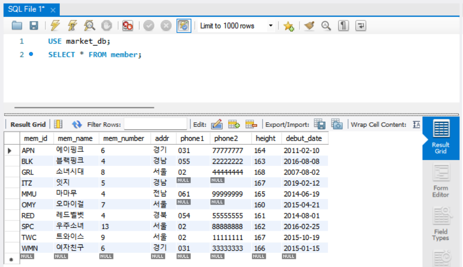
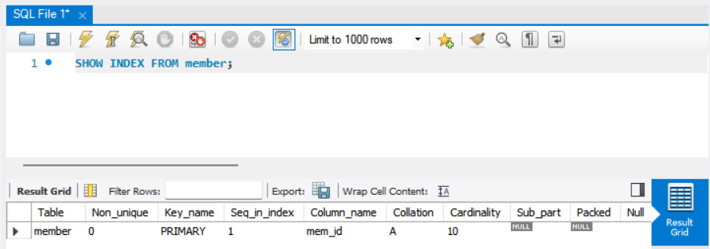
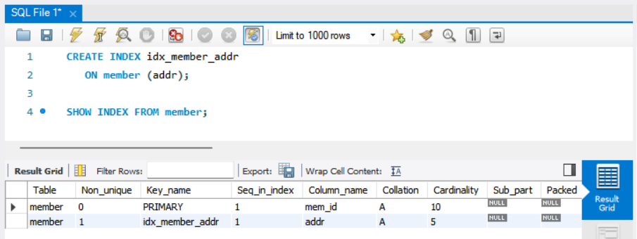
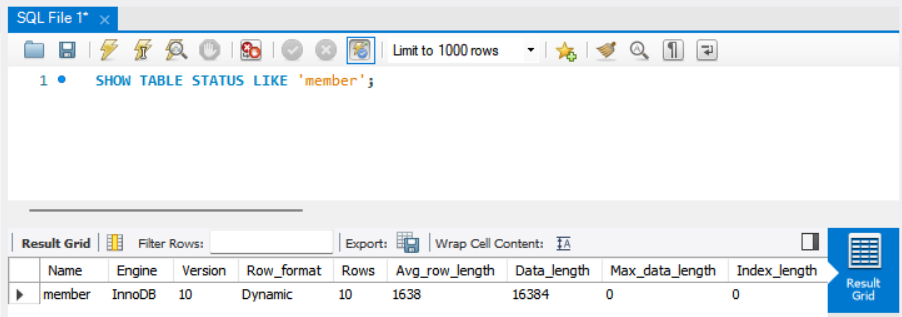
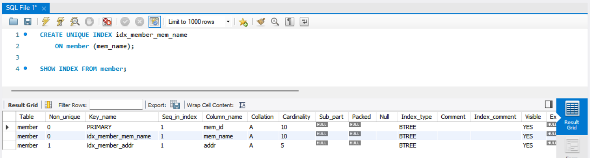
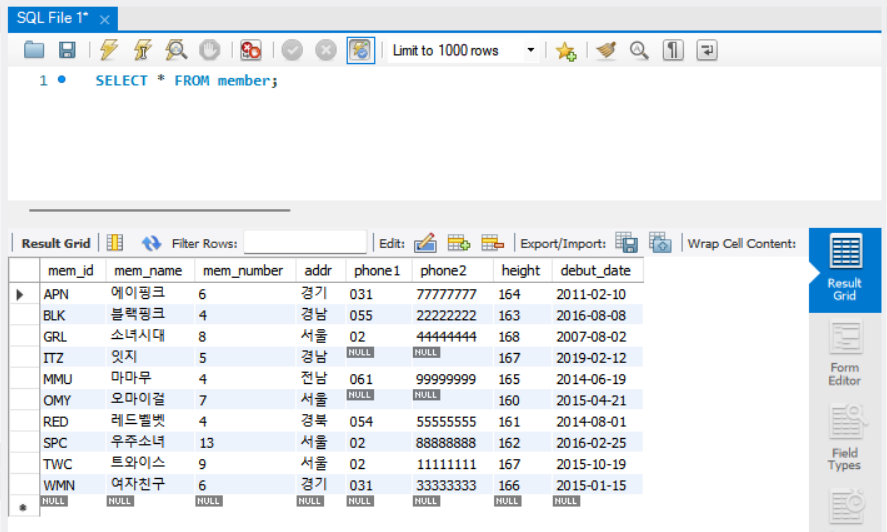
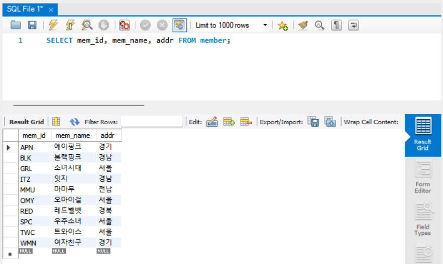
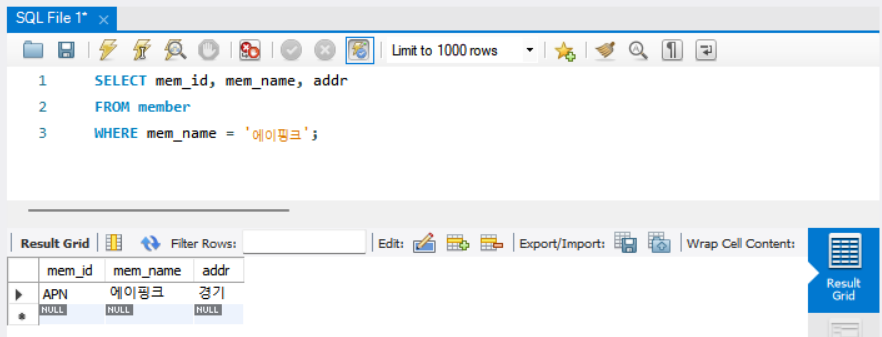
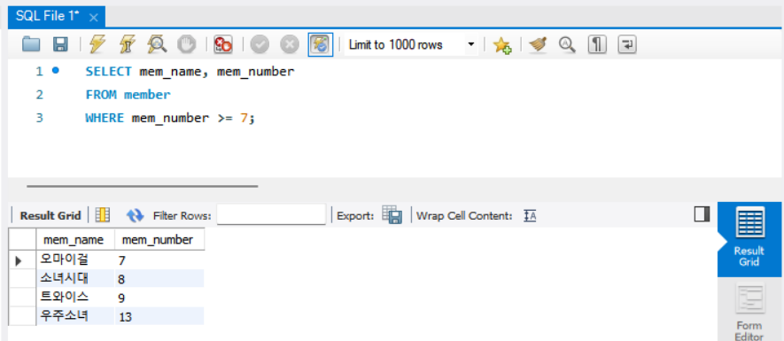
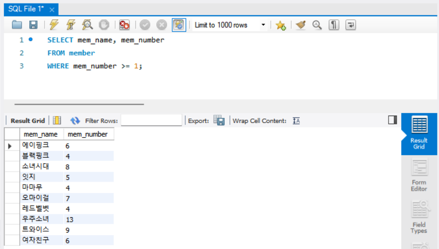
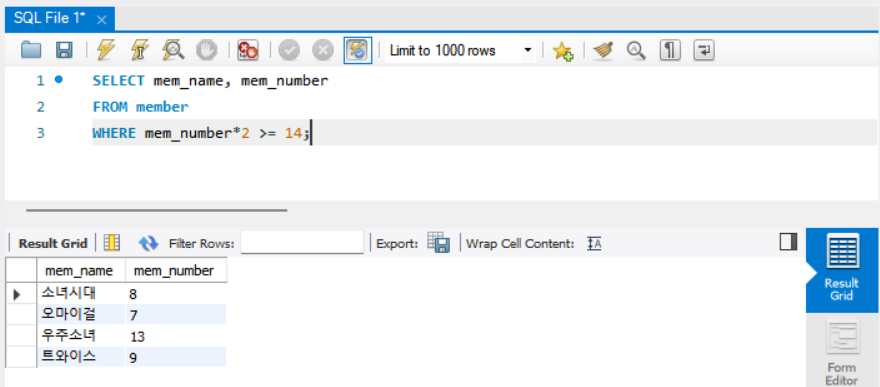
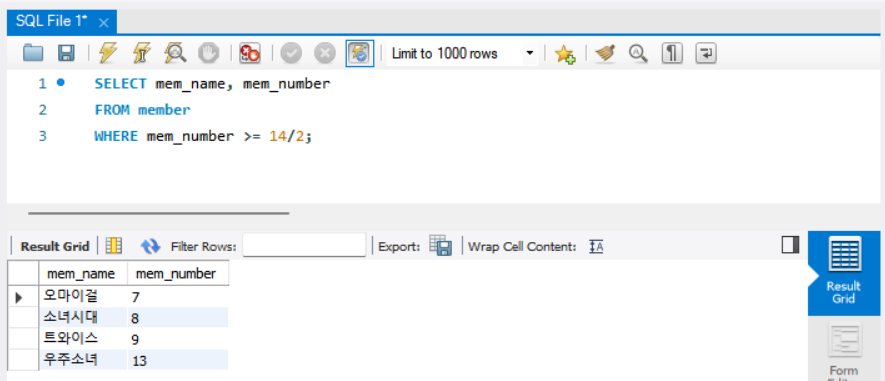
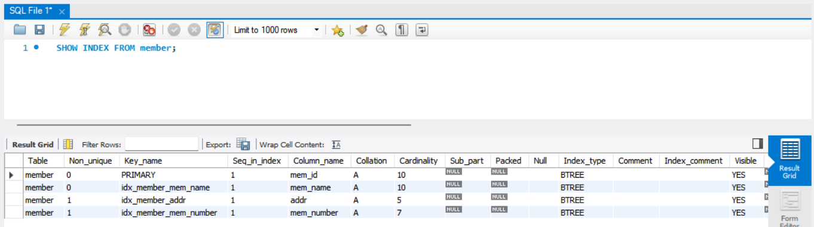
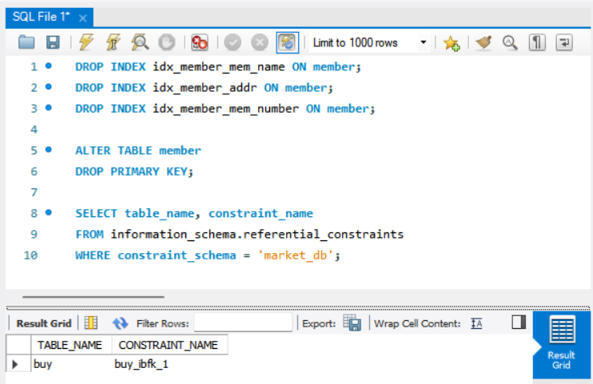


---

# 2️⃣ 실습과제

## 1. 데이터베이스 구축

아래 코드를 MySQL Workbench에 붙여넣은 후,  
**전체 드래그 → 실행 (Ctrl + Shift + Enter)** 하여 데이터베이스를 생성하세요.

```sql
CREATE DATABASE IF NOT EXISTS week5_db;
USE week5_db;

DROP TABLE IF EXISTS employees;

CREATE TABLE employees (
    emp_id INT PRIMARY KEY,
    name VARCHAR(20),
    department VARCHAR(30),
    salary INT,
    hire_date DATE
);

INSERT INTO employees VALUES
(1, '신영', 'Marketing', 3500, '2026-03-01'),
(2, '경모', 'HR', 3200, '2026-06-15'),
(3, '세원', 'IT', 4000, '2024-09-10'),
(4, '진우', 'HR', 5000, '2024-01-20'),
(5, '성환', 'Actuary', 3800, '2025-04-01'),
(6, '혜준', 'Judge', 4500, '2025-12-01'),
(7, '채은', 'HR', 3700, '2026-08-18'),
(8, '다나', 'Actuary', 3700, '2025-08-18');
```

## 2. 실습 문제

다음 문제를 수행하고 실행 결과를 캡처하여 제출하세요.

1. department 컬럼에 보조 인덱스를 생성하시오.
    - 인덱스 생성 후, `SHOW INDEX FROM employees;` 실행 결과가 보이도록 캡처합니다.
    - (idx_department 인덱스가 존재하는지 확인되어야 합니다.)
2. employees 테이블의 인덱스를 확인하시오.
3. department가 'Sales'인 직원을 조회하시오.
   - 'Sales' 조회 시, 반드시 `EXPLAIN`을 함께 실행한 화면을 캡처합니다.
   - (key 컬럼에 idx_department가 표시되어야 합니다.)
4. 생성한 인덱스를 삭제하시오.
   - 인덱스 삭제 후, 다시 `SHOW INDEX FROM employees;`를 실행하여 idx_department가 사라진 것을 확인한 화면을 캡처합니다.

## 3. 제출방법

인덱스 생성 결과, EXPLAIN 실행 결과, 인덱스 삭제 결과가 모두 보이도록 캡처하여 제출하세요.

#1
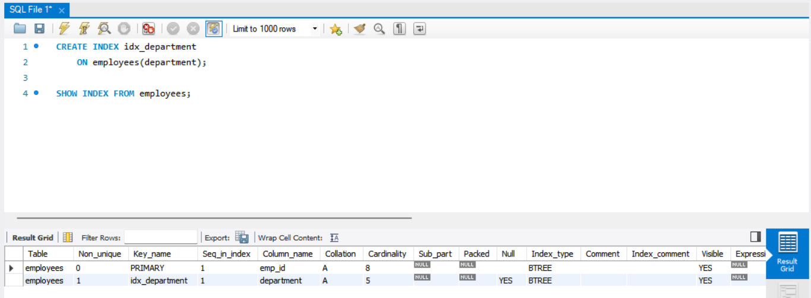
#2
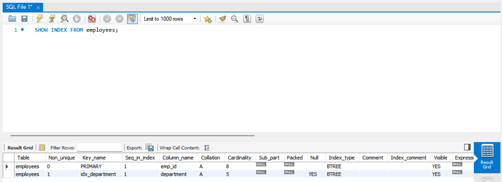
#3
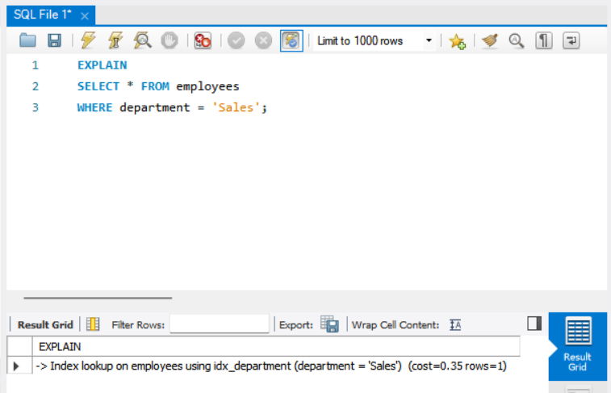
#4
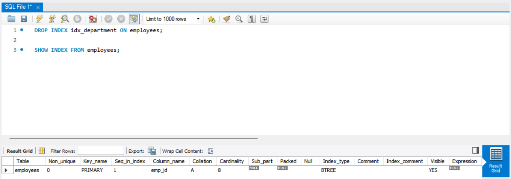

### 🎉 수고하셨습니다.